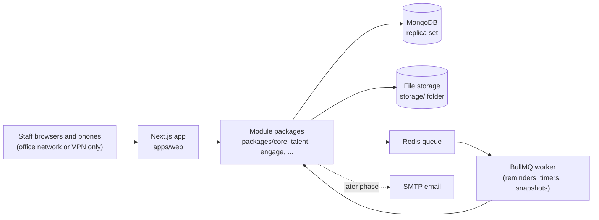
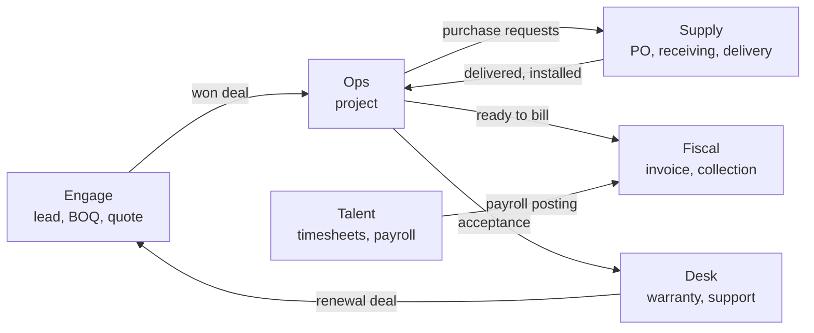

# Architecture

How Xtreme Pulse is put together: one Next.js application split into module packages, a MongoDB replica set, a background worker, and private file storage. What each module does is in the [module specs](modules/README.md). Why the main choices were made is in the [decision records](adr/README.md).

## System overview



Nothing is reachable from the public internet (see [Network exposure](../SECURITY.md#network-exposure)).

## One application

- Every module is part of **one application, Xtreme Pulse**. There are no separate apps per module.
- Users sign in once at the Pulse Core login, land on the Pulse Core home page, and open each module from the sidebar as a section of the app (`/engage`, `/ops`, `/supply`, `/desk`, `/fiscal`, `/talent`, `/insight`).
- The sidebar lists only the modules the user has at least Read access to (see [Module access](../SECURITY.md#module-access-rwo)).
- Every module, including Pulse Talent, is built new inside Xtreme Pulse. There is no existing application to migrate.

## Modules and packages

| Module | Route | Package | Spec |
|---|---|---|---|
| Pulse Core | `/`, `/admin`, login | `packages/core` | [core.md](modules/core.md) |
| Pulse Talent | `/talent` | `packages/talent` | [talent.md](modules/talent.md) |
| Pulse Engage | `/engage` | `packages/engage` | [engage.md](modules/engage.md) |
| Pulse Ops | `/ops` | `packages/ops` | [ops.md](modules/ops.md) |
| Pulse Supply | `/supply` | `packages/supply` | [supply.md](modules/supply.md) |
| Pulse Fiscal | `/fiscal` | `packages/fiscal` | [fiscal.md](modules/fiscal.md) |
| Pulse Desk | `/desk` | `packages/desk` | [desk.md](modules/desk.md) |
| Pulse Insight | `/insight` | `packages/insight` | [insight.md](modules/insight.md) |

Shared packages: `packages/db` (connection, transactions, shared master-data schemas) and `packages/ui` (design tokens and components).

## Tech stack

- Next.js (App Router), full-stack, TypeScript (strict)
- MongoDB (replica set required for transactions), Mongoose
- Zod for all input validation (Server Actions, Route Handlers, forms)
- Auth.js with the Credentials provider (email + password); authorization lives in `packages/core`
- Tailwind CSS + shadcn/ui; TanStack Table for data grids
- Charts: Recharts (SVG), styled with the design tokens
- Background jobs (SLA timers, timesheet and remittance reminders, Ops reminders (site reports, assignment changes), Fiscal reminders (tax due dates, missing 2307s, month-end close), Insight month-end snapshots and the weekly Board summary, renewal, expiry, probation and holiday alerts, reports): BullMQ + Redis
- File storage: a `storage/` folder with the app, outside `public/` (receipts, medical certificates, 201 files, generated PDFs); see [File storage](#file-storage)
- PDF generation for payslips, HR documents and reports (e.g. `@react-pdf/renderer`)
- Excel export for reports (e.g. `exceljs`)
- Email (later phase, for password reset and email notifications): Nodemailer over SMTP

## Repository layout

```
apps/web/                         the single Xtreme Pulse Next.js app
  app/(auth)/login/               Pulse Core login (the only public route; forgot/reset password later)
  app/(pulse)/layout.tsx          signed-in shell: sidebar with the user's modules, session + status check
  app/(pulse)/page.tsx            Pulse Core home
  app/(pulse)/admin/              system administration (HR and System Administrator), e.g. /admin/access for user access
  app/(pulse)/<module>/           one folder per module: engage, ops, supply, desk, fiscal, talent, insight
packages/core/                    auth, module access, audit log, approvals, notifications, directory, org chart, holidays
packages/db/                      Mongo connection, shared master-data schemas
packages/<module>/                models, services and validation for each module
packages/ui/                      shared components
scripts/                          seed scripts (e.g. seed-admin.ts)
storage/                          uploaded and generated files (git-ignored, never under public/)
```

The documentation lives alongside the code:

```
README.md, AGENTS.md, CLAUDE.md   entry points for people and coding agents
SECURITY.md, CONTRIBUTING.md, CHANGELOG.md
.env.example                      every environment variable, without values
docs/                             architecture, data model, design system, code style, testing,
                                  compliance, glossary, deployment, runbook, roadmap, build plan
docs/modules/                     one spec per module
docs/adr/                         architecture decision records
```

## Architecture rules

- Modular monolith. Each module owns its collections.
- A module **never writes to another module's collections**. Call the owning module's service functions instead.
- Pages and Server Actions stay thin: validate with Zod, check module access and permissions, call a service in `packages/<module>`.
- Every create/update/delete on business records writes an audit log entry via `packages/core`.
- Pulse Insight never changes other modules' data. It only reads them (through their service functions or read-only queries) and writes its own month-end snapshots and targets.
- Use Server Components by default; add `"use client"` only where interactivity requires it.

## File storage

Uploaded and generated files live in a folder with the app, not in a separate storage service (see [ADR 0011](adr/0011-file-storage-in-project-folder.md)). That covers receipts, medical certificates, 201 files, e-signatures, profile and site photos, attachments and generated PDFs.

- **One folder.** Files go under `storage/` at the repo root by default. The path comes from `FILE_STORAGE_DIR`, so production can use another folder without a code change.
- **Never public.** The folder sits outside `apps/web/public/`, and nothing serves it directly. A file opens only through one Route Handler, which checks that the viewer may see the record the file belongs to and then streams it. A copied link is useless to anyone who couldn't open the record.
- **Never committed.** `storage/` is in `.gitignore`, so employee files never end up in Git.
- **One storage service.** Modules save and read files only through the storage service built in step 0.7. Moving to S3 or a network drive later means changing that service alone.
- **Safe names.** Files are saved under generated IDs, never under the uploaded name or a path taken from the user. The original name, type, size and owning record are kept in the database. Uploads are checked against allowed file types and a maximum size, both settings.
- **Kept across deploys and backed up.** A deploy must never replace or empty `storage/`. Backups must include it along with the database and the encryption key (see [DEPLOYMENT.md](DEPLOYMENT.md#still-to-decide)).

## Cross-module integration

Modules talk to each other only through the owning module's service functions. This table lists the calls the specs require, so each service is built with its callers in mind.

| Caller | Calls | For | Spec |
|---|---|---|---|
| Every module | Core | Access checks, approvals, notifications, audit log, master data | [core.md](modules/core.md) |
| Engage | Core | Create and edit clients, sites, contacts and products | [Clients, sites and contacts](modules/engage.md#clients-sites-and-contacts) |
| Engage | Ops | Create the project when a deal is won | [Won deals → Pulse Ops](modules/engage.md#won-deals--pulse-ops) |
| Engage, Ops | Talent | Read certifications for presales and assignments | [Skills & certifications](modules/talent.md#skills--certifications) |
| Ops | Talent | Read approved leave and offset time off (availability) and overtime hours (project costs) | [Scheduling](modules/ops.md#scheduling), [Project costs](modules/ops.md#project-costs) |
| Ops | Supply | Delivery status, equipment per site, purchase requests from quotation lines | [Equipment installed](modules/ops.md#equipment-installed-with-pulse-supply) |
| Ops | Fiscal | Ready-to-bill milestones become invoices | [Billing milestones](modules/ops.md#billing-milestones-from-payment-terms) |
| Ops | Desk | Start warranties at acceptance | [Handover and acceptance](modules/ops.md#handover-and-acceptance) |
| Ops, Desk | Core | Create sites during rollout and fleet imports | [Multi-site rollouts](modules/ops.md#multi-site-rollouts) |
| Supply | Core | Manage suppliers and catalog items | [Suppliers](modules/supply.md#suppliers) |
| Supply | Fiscal | Post equipment cost of deliveries and issues to projects | [Project costs](modules/ops.md#project-costs) |
| Talent | Supply | Show each employee's assigned assets | [Company-issued assets](modules/supply.md#company-issued-assets) |
| Talent | Fiscal | Post payroll runs and final pay, record remittances | [Payroll run & payslips](modules/talent.md#payroll-run--payslips) |
| Fiscal | Talent | Duplicate-receipt check for petty cash; list the compensation tax forms | [Reimbursements](modules/talent.md#reimbursements), [BIR tax reports](modules/fiscal.md#bir-tax-reports) |
| Fiscal | Ops | Mark milestones Invoiced and Paid | [Sales invoices (AR)](modules/fiscal.md#sales-invoices-ar) |
| Fiscal | Insight | Snapshot key figures at month-end close | [Data freshness](modules/insight.md#data-freshness) |
| Desk | Engage | Create renewal deals | [Renewals](modules/desk.md#renewals) |
| Desk | Supply | Issue parts to tickets, swaps and pull-outs, serials for imported terminals | [POS terminal fleet](modules/desk.md#pos-terminal-fleet) |
| Desk | Ops | Schedule site visits on the Ops calendar | [On-site visits and service reports](modules/desk.md#on-site-visits-and-service-reports) |
| Desk | Fiscal | Invoice support contracts and chargeable work | [Chargeable work](modules/desk.md#chargeable-work) |
| Insight | Every module | Read-only figures | [Pulse Insight](modules/insight.md) |

The business lifecycle these calls support:



## Placeholders during the staged build

Modules are built in order (see [Build order](ROADMAP.md#build-order)), so some handoffs point at modules that don't exist yet. Until the later module ships, the earlier one shows a placeholder:

| Until this ships | This placeholder is shown | Spec |
|---|---|---|
| Pulse Ops | "Ready for project" handoff list in Engage | [Won deals → Pulse Ops](modules/engage.md#won-deals--pulse-ops) |
| Pulse Fiscal | "Ready to bill" list in Ops, manual subcontractor costs, Talent posting placeholders | [Billing milestones](modules/ops.md#billing-milestones-from-payment-terms), [Project costs](modules/ops.md#project-costs) |
| Pulse Desk | "Warranty to start" on accepted projects | [Handover and acceptance](modules/ops.md#handover-and-acceptance) |
| Pulse Ops, Pulse Desk | Project and ticket pickers on timesheet entries | [Daily time entries](modules/talent.md#daily-time-entries) |
| Pulse Supply | Company-issued assets item in onboarding | [Onboarding (first sign-in)](modules/talent.md#onboarding-first-sign-in) |

## Background jobs

All scheduled work runs in the BullMQ worker on Asia/Manila time. Where the spec doesn't give a cadence, the table says so. Settle it in the build step.

| Job | When | Spec |
|---|---|---|
| Next year's holidays drafted | Every October 1 | [Holiday calendar](modules/core.md#holiday-calendar) |
| Unconfirmed holidays reminder to HR | Weekly from December 1 until confirmed | [Holiday calendar](modules/core.md#holiday-calendar) |
| Users still needing access | Daily | [User access page](modules/core.md#user-access-page) |
| Timesheet reminders and missing list | Before and at the deadline | [Submission & approval](modules/talent.md#submission--approval) |
| 201 document and certification expiry | Daily, 30 days ahead by default | [Documents (201 file)](modules/talent.md#documents-201-file), [Skills & certifications](modules/talent.md#skills--certifications) |
| Probation and contract alerts | 30 days ahead; daily escalation after an undecided probation ends | [Probation & contract tracking](modules/talent.md#probation--contract-tracking) |
| Remittance due dates | Before each agency's due date | [Employer contributions & monthly remittances](modules/talent.md#employer-contributions--monthly-remittances) |
| Final pay due date | As the 30-day due date approaches | [Final pay](modules/talent.md#separation-final-pay--certificate-of-employment) |
| Deal registration expiry | Daily; alerts 30 and 7 days ahead | [Deal registration](modules/engage.md#deal-registration) |
| Quotation expiry | Daily; alert 3 days ahead | [Quotations](modules/engage.md#quotations) |
| Set-date billing milestones | Daily | [Billing milestones](modules/ops.md#billing-milestones-from-payment-terms) |
| Site reports not filed, pending deliveries, overdue POs | Not specified | [Pulse Ops notifications](modules/ops.md#notifications), [Pulse Supply notifications](modules/supply.md#notifications) |
| Overdue invoices, missing 2307s, tax due dates, bank reconciliation, month-end close | Not specified | [Pulse Fiscal notifications](modules/fiscal.md#notifications) |
| SLA timers | Continuously per open ticket; alerts at 75% and at breach | [SLA and escalation](modules/desk.md#sla-and-escalation) |
| Renewal alerts and renewal deals | Daily; 90, 60 and 30 days ahead | [Renewals](modules/desk.md#renewals) |
| Support contract billing, preventive visits | When due | [Warranties, support contracts and subscriptions](modules/desk.md#warranties-support-contracts-and-subscriptions) |
| Month-end snapshot | When a Fiscal Owner closes a month | [Data freshness](modules/insight.md#data-freshness) |
| Weekly Board summary | Mondays, 8:00 AM | [Weekly Board summary](modules/insight.md#weekly-board-summary) |

## Data

Money, ledger, stock and general data rules, collection ownership and document numbering are in [DATA_MODEL.md](DATA_MODEL.md).
