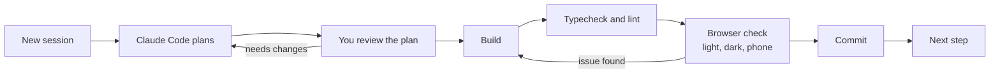

# Xtreme Pulse Build Plan

Sep 24, 2026 · @Klyde

A phase-by-phase plan for building Xtreme Pulse with Claude Code, following the [build order](ROADMAP.md#build-order).

## How to use this plan

Each step is one Claude Code session, and the phases follow the [build order](ROADMAP.md#build-order). Work through the steps in order.

**Setup:** `CLAUDE.md` and `AGENTS.md` sit at the repo root and the specs live in `docs/` (see the [documentation map](../README.md#documentation)). Claude Code loads `CLAUDE.md` automatically, which imports `AGENTS.md`. At the start of every step it reads this plan and the docs linked in that step's **Spec** line.

**Start every step with this prompt.** Replace `<N.M>` with the step number, for example `1.3`.

```text
Read docs/BUILD_PLAN.md, then build step <N.M> only. Before planning, read the docs linked in that step's Spec line.

1. Plan first. Show me the plan and wait for my go-ahead before writing any code.
2. When the build is done, run pnpm typecheck and pnpm lint, and fix anything they report.
3. Tell me how to check this step in the browser, in light and dark appearance and at phone width.
4. List anything in the docs that was unclear, and what you assumed.
```



Nothing is built until you approve the plan, and nothing is committed until you have checked it yourself.

- **Keep steps small.** Push back if a plan goes beyond the step. Ask Claude Code to drop anything from a later step or outside the specs.
- **Spec first.** When something in the spec must change, or Claude Code lists something unclear, update the doc that owns the rule first, then continue (see [CONTRIBUTING.md](../CONTRIBUTING.md#change-the-spec-first)).
- **Phase review.** At the end of each phase, ask Claude Code to review the whole phase against the docs with a review sub-agent. Fix what it finds, then do the phase check.
- **Commit often.** Commit after every checked step, so any step can be rolled back.
- **No automated tests yet.** You chose to skip them for now, so each step is checked with typecheck, lint and your browser check. Tests can be added later (see [TESTING.md](TESTING.md)).
- **UI reference.** The [Xtreme Pulse screens](https://claude.ai/artifact/REqSjEy78c7ZQUGwy3dQ9e) design canvas shows the approved look. Point Claude Code to it for any screen it covers.
- **Data first.** When a step builds a module's main screen, that screen leads with small charts and trend tiles from the user's own data ([Data-rich](DESIGN_SYSTEM.md#data-rich)).

## Before you start

The tools to install, the local setup and the environment variables have moved out of this plan:

- **Tools to install and first run:** [README.md › Getting started](../README.md#getting-started)
- **Environment variables:** [DEPLOYMENT.md › Environment variables](DEPLOYMENT.md#environment-variables), with every name listed in `.env.example`
- **Field encryption and the MongoDB edition:** [ADR 0005](adr/0005-field-level-encryption.md), settled in step 0.8

## Phase 0: Foundation

When Phase 0 is done, an empty Xtreme Pulse app runs on your computer with its design system, app shell and shared building blocks. There are no module features yet; every later phase builds on this.

### Steps

1. **0.1 Monorepo and tooling.** Set up pnpm workspaces for `apps/web` (Next.js App Router), `packages/core`, `db`, `ui`, one package per module, and `scripts/`. Add TypeScript strict, ESLint, Prettier, and the `pnpm dev`, `lint`, `typecheck` and `seed:admin` (placeholder) scripts. Add a `docker-compose.yml` with a single-node MongoDB replica set and Redis, plus `.env.example` and a `.gitignore` that excludes `.env.local` and `storage/`. Spec: [Tech stack](ARCHITECTURE.md#tech-stack); [Repository layout](ARCHITECTURE.md#repository-layout); [File storage](ARCHITECTURE.md#file-storage); [Commands](../AGENTS.md#commands); [Conventions](CODE_STYLE.md#naming) ([data naming](DATA_MODEL.md#naming), [document numbers](DATA_MODEL.md#document-numbers)).
   - Done when: `docker compose up` starts both services, and `pnpm dev` shows a starter page in the browser.
2. **0.2 Design tokens and theme.** In `packages/ui`, define the Cobalt palette, type scale (in `rem`), radii, spacing, glass, shadow and motion values as CSS variables in the Tailwind theme. Set up shadcn/ui and the font stack on these tokens, with light and dark following the OS. Add fallbacks for reduced motion, reduced transparency and no `backdrop-filter`, and a development-only `/dev/ui` page (never served in production builds) that shows every token. Spec: [UI & design](DESIGN_SYSTEM.md) ([Typography](DESIGN_SYSTEM.md#typography), [Color: Cobalt palette](DESIGN_SYSTEM.md#color-cobalt-palette), [Advanced look](DESIGN_SYSTEM.md#advanced-look-approved-direction), [Feedback & motion](DESIGN_SYSTEM.md#feedback--motion), [Accessibility](DESIGN_SYSTEM.md#accessibility)).
   - Done when: `/dev/ui` shows every color and type style, and switches between light and dark with the OS setting.
3. **0.3 App shell and routes.** Build the macOS-style glass sidebar, listing every module for now (Phase 1 filters it by module access). Add the top toolbar with the ⌘K / Ctrl+K command bar shell, notification and help buttons, and the large-title page header. Use them in the `app/(pulse)` layout with placeholder pages (home, each module, `/admin`), plus the `app/(auth)/login` placeholder and skeleton, empty and error states. Spec: [One application](ARCHITECTURE.md#one-application); [Repository layout](ARCHITECTURE.md#repository-layout); [UI & design](DESIGN_SYSTEM.md) ([Layout & components](DESIGN_SYSTEM.md#layout--components), [Advanced look](DESIGN_SYSTEM.md#advanced-look-approved-direction), [Feedback & motion](DESIGN_SYSTEM.md#feedback--motion)).
   - Done when: every module opens from the sidebar inside the shell, ⌘K / Ctrl+K opens the command bar, and the layout holds at phone width.
4. **0.4 Shared components.** On shadcn/ui and Lucide, build the sheet, the inspector panel (a full-height sheet on phones) and the segmented control. Add inset grouped form sections with inline validation, the data table on TanStack Table, and a Recharts wrapper that requires an accessible name. Add the destructive confirm dialog and shortcut hints (⌘↵ / Ctrl+Enter), give every control a 44×44px touch target, and show each component on `/dev/ui`. Spec: [UI & design](DESIGN_SYSTEM.md) ([Layout & components](DESIGN_SYSTEM.md#layout--components), [Advanced look](DESIGN_SYSTEM.md#advanced-look-approved-direction), [Feedback & motion](DESIGN_SYSTEM.md#feedback--motion), [Accessibility](DESIGN_SYSTEM.md#accessibility)).
   - Done when: every component on `/dev/ui` works by keyboard and looks right in light, dark and at phone width.
5. **0.5 Database package.** In `packages/db`, add the Mongoose connection and a transaction helper built on `session.withTransaction`. Add a base schema plugin for `createdAt`, `updatedAt`, `createdBy`, `updatedBy` and soft delete (`deletedAt`), leaving soft-deleted records out of normal queries. Follow the naming conventions, and add a development-only `/dev/health` page that checks the database. Spec: [Architecture rules](ARCHITECTURE.md#architecture-rules); [Data rules](DATA_MODEL.md#data-rules-critical) ([Money](DATA_MODEL.md#money), [General](DATA_MODEL.md#general)); [Conventions](CODE_STYLE.md#naming) ([data naming](DATA_MODEL.md#naming), [document numbers](DATA_MODEL.md#document-numbers)).
   - Done when: `/dev/health` shows MongoDB connected and a test transaction committed on the replica set.
6. **0.6 Shared helpers.** Add money helpers (integer centavos, half-up rounding at the line level, PHP display) and date helpers (store UTC, display Asia/Manila). Add atomic document number counters (`PREFIX-YYYY-NNNN`) and an effective-dated, versioned configuration store for rates and tables. Add the Zod pattern for Server Actions that returns field errors for inline validation, with a slot for the access check Phase 1 adds. Spec: [Data rules](DATA_MODEL.md#data-rules-critical) ([Money](DATA_MODEL.md#money), [General](DATA_MODEL.md#general)); [Architecture rules](ARCHITECTURE.md#architecture-rules); [Conventions](CODE_STYLE.md#naming) ([data naming](DATA_MODEL.md#naming), [document numbers](DATA_MODEL.md#document-numbers)); [Tech stack](ARCHITECTURE.md#tech-stack); [Payroll](modules/talent.md#payroll).
   - Done when: `/dev/health` issues two numbers in sequence, resolves a setting by date, and shows correct half-up rounding and Manila time.
7. **0.7 Files, jobs and exports.** Add file storage in the `storage/` folder (path from `FILE_STORAGE_DIR`, outside `public/`): one storage service that saves files under generated names, and one Route Handler that serves them, with a slot for the access check Phase 1 adds. Add a BullMQ worker process, started by `pnpm dev`, and a scheduler skeleton that runs jobs on Asia/Manila time. Add PDF (`@react-pdf/renderer`) and Excel (`exceljs`) export helpers, and extend `/dev/health` to check storage, Redis and the worker. Spec: [Tech stack](ARCHITECTURE.md#tech-stack); [File storage](ARCHITECTURE.md#file-storage); [Sensitive data](../SECURITY.md#sensitive-data).
   - Done when: a test upload lands in `storage/` under a generated name and opens only through the file route (never by a direct URL), a test job runs, and sample PDF and Excel files download.
8. **0.8 Sensitive data helper.** Add field encryption at rest with a key vault and the local master key, choosing automatic or explicit encryption to match your MongoDB edition. Record the choice in [ADR 0005](adr/0005-field-level-encryption.md) and the [Sensitive data](../SECURITY.md#sensitive-data) section of SECURITY.md. Add a masked field component that shows the last 4 digits and fetches the full value only on reveal, ready for Phase 1's audit log. Spec: [Sensitive data (Data Privacy Act of 2012, RA 10173)](../SECURITY.md#sensitive-data).
   - Done when: `/dev/health` shows a sample value stored as ciphertext, and `/dev/ui` shows it masked to the last 4 digits until revealed.

**Phase check:** Run the phase review, fix what it finds, then confirm the foundation works end to end.

- `docker compose up` and `pnpm dev` start the services, the app and the worker without errors.
- The shell, the placeholder pages and `/dev/ui` look right in light and dark appearance and at phone width.
- `/dev/health` reports MongoDB (with a transaction), Redis, the worker, storage and encryption as working.
- `pnpm typecheck` and `pnpm lint` pass.

## Phase 1: Pulse Core

When Phase 1 is done, HR and the System Administrator can sign in, create users, set module access and run the holiday calendar. Every later module builds on Core's access checks, approvals, notifications, audit log and master data services.

### Steps

1. **1.1 Core schemas and seed script.** Add the Core schemas: users (the account), employees (the identity Core owns), departments, positions, employeeNumberCounters and companySettings, plus the ALLOWED\_EMAIL\_DOMAINS and EMPLOYMENT\_STATUS constants. Write pnpm seed:admin (scripts/seed-admin.ts) to create the bootstrap System Administrator from SEED\_ADMIN\_EMAIL and SEED\_ADMIN\_PASSWORD, flagged to change its password. It also loads allowed domains, departments, positions with timesheet types and company settings placeholders, one loader per data set, which later phases extend. If a System Administrator already exists, the script skips creating one, and each loader inserts only missing records, never overwriting existing ones. Spec: [Bootstrap System Administrator account](modules/core.md#bootstrap-system-administrator-account); [Account & access](../SECURITY.md#account--access); [Departments and positions](modules/core.md#departments-and-positions); [Company details](modules/core.md#company-details-pending-from-the-client); [Conventions](CODE_STYLE.md#naming) ([data naming](DATA_MODEL.md#naming), [document numbers](DATA_MODEL.md#document-numbers)).
   - Done when: on an empty database, pnpm seed:admin creates the account and base data; a second run creates no second admin, changes no existing record, and adds only data a new loader brings.
2. **1.2 Sign-in, password change and status check.** Set up Auth.js Credentials with JWT sessions: lowercase the email, check the allowed domains, verify the argon2id hash and require an active account. A temporary password forces a change-password page first, and the hero login page has no Forgot password link (a future release). Add getCurrentUser, which reloads the account on every request and signs out deactivated users, plus role helpers for HR, Accounting, Board and System Administrator (HR, Accounting and Board come from the department). Sessions last 24 hours. Spec: [Account & access](../SECURITY.md#account--access); [Bootstrap System Administrator account](modules/core.md#bootstrap-system-administrator-account); [UI & design](DESIGN_SYSTEM.md).
   - Done when: the bootstrap account signs in, must set a new password before anything else, and an email on another domain gets an inline error.
3. **1.3 Audit log, notifications and sensitive reveal.** Build the append-only audit log service (actor, module, record, action, old and new values, reason) and a System Administrator page to browse it. Build in-app notifications: a notify service, a toolbar bell with an unread badge, and a list linking to each record. Wire the Phase 0 masked-field reveal to a Server Action that checks the Sensitive data rules and audit-logs the field, never the value. Spec: [Architecture rules](ARCHITECTURE.md#architecture-rules); [Sensitive data](../SECURITY.md#sensitive-data); [Notifications](modules/core.md#notifications).
   - Done when: changing a password writes an audit entry with no password value, and the bell shows its designed empty state.
4. **1.4 Departments, positions and company settings.** Build /admin screens for departments (name, code, optional department head) and positions (name, department, timesheet type), with add, edit and retire. Build the company settings page for the System Administrator, including the logo upload, allowed email domains and system-wide settings. While any company detail is still a placeholder, HR and the System Administrator see a reminder and get a notification. Spec: [Departments and positions](modules/core.md#departments-and-positions); [Company details](modules/core.md#company-details-pending-from-the-client); [System Administrator](../SECURITY.md#system-administrator).
   - Done when: a new position shows with its timesheet type and an audit entry, and the reminder clears once every company detail is filled in.
5. **1.5 User accounts and employee numbers.** Build /admin/users with a create sheet for the identity Core owns, plus temporary and reset passwords (only a System Administrator resets a System Administrator's password); Phase 2 adds the full employee record. Generate YYYY-NN numbers from the atomic per-year counter (maximum 99), or accept an existing company ID and raise that year's counter. Map employment status to account status, keeping Terminated blocked until Phase 2 adds due process, and validate reportingTo per Reporting lines. Spec: [Account & access](../SECURITY.md#account--access); [Employee number (company ID)](modules/core.md#employee-number-company-id); [Reporting lines](modules/core.md#reporting-lines); [System Administrator](../SECURITY.md#system-administrator).
   - Done when: after a manual 2027-99 the next 2027 hire fails clearly, and a user Resigned as of today is signed out on their next click.
6. **1.6 Module access and the signed-in shell.** Add MODULES, ACCESS\_LEVELS and ModuleAccess in packages/core, plus requireModuleAccess(module, level) for every page, Server Action and Route Handler. The System Administrator always resolves to Owner (Read on Insight), and a blocked route shows a designed no-access state. The sidebar shows only readable modules, plus Admin for HR and the System Administrator; Home shows the hero and the access-being-set-up message. Spec: [Module access (RWO)](../SECURITY.md#module-access-rwo); [System Administrator](../SECURITY.md#system-administrator); [One application](ARCHITECTURE.md#one-application); [UI & design](DESIGN_SYSTEM.md).
   - Done when: a new user sees only Pulse Core with "Your access is being set up", and gets the no-access state at /fiscal and /admin.
7. **1.7 User access page.** Build /admin/access as specified: the list with search, filters and access summaries, the pinned Needs access group, and the sidebar badge. The sheet saves all module rows at once and audit-logs each change, with read-only rows, the Board members hint and the System Administrator switch. After creating a user, open their sheet, and notify HR and the System Administrator of new users, missing access (daily) and position changes. Spec: [User access page](modules/core.md#user-access-page); [Module access (RWO)](../SECURITY.md#module-access-rwo); [System Administrator](../SECURITY.md#system-administrator).
   - Done when: HR sets Talent Write for a user, Talent appears in their sidebar, the audit log shows both levels, and HR's own row is read-only.
8. **1.8 Shared master data services.** Add the master data schemas in packages/db and their services in packages/core: clients with sites and contacts, products (brands), catalog items and suppliers. Catalog items carry their product, part number, description, unit, item kind (serialized, bulk, or non-stock for services and licenses), and default warranty months. Seed the products and build basic System Administrator screens under /admin; Engage (Phase 3) and Supply (Phase 4) build full screens on these services. Spec: [Architecture rules](ARCHITECTURE.md#architecture-rules); [Deals and stages (products)](modules/engage.md#deals-and-stages); [Clients, sites and contacts](modules/engage.md#clients-sites-and-contacts); [Suppliers](modules/supply.md#suppliers); [Stock](modules/supply.md#stock); [Warranties, support contracts and subscriptions](modules/desk.md#warranties-support-contracts-and-subscriptions).
   - Done when: the System Administrator adds a client with two sites and a contact, and the products list shows all 13 seeded brands.
9. **1.9 Approvals engine.** Build the approvals engine, with steps routed to reportingTo, any one of a set (the Board), or all of a set (payment approvers). The first decision settles an any-one step and notifies the others; a return needs remarks; a self-only step goes to the System Administrator. Add same-transaction hooks for modules, a read-only approver access check and an Approvals list; Phase 2 adds e-signatures to decisions. Spec: [Reporting lines](modules/core.md#reporting-lines); [Module access (RWO)](../SECURITY.md#module-access-rwo); [Timesheets & attendance](modules/talent.md#timesheets--attendance) ([Submission & approval](modules/talent.md#submission--approval)); [Payroll run & payslips](modules/talent.md#payroll-run--payslips); [Payments (disbursements)](modules/fiscal.md#payments-disbursements).
   - Done when: a dev-script request reaches every supervisor, the first approval settles it and notifies the others, and a self-only step reaches the System Administrator.
10. **1.10 Holiday calendar.** Build the holiday calendar: HR and the System Administrator manage and confirm holidays, drafts stay HR-only, and ad-hoc declarations notify every user. Add BullMQ jobs: the October 1 auto-draft from seed configuration, which HR can also run once for a chosen year ([Going live](DEPLOYMENT.md#going-live) item 4 uses it for the current year), the optional online source added as drafts, and the December 1 weekly reminder. Emit a holidays-changed event that Phase 2 hooks to recompute DTRs for payroll periods not yet finalized; until then it does nothing. Spec: [Holiday calendar](modules/core.md#holiday-calendar).
    - Done when: running the auto-draft job by hand creates next year's drafts with correct Holy Week dates, and other users see only confirmed holidays.
11. **1.11 Directory, org chart, command bar and Home tiles.** Build the directory and the reportingTo org chart; cards open in the inspector, where HR, the Board and the System Administrator edit reporting lines. The command bar searches people and actions through a provider registry that later phases extend with their records, filtered by access. Home adds tiles from the user's own data (approvals waiting, unread notifications, upcoming holidays, their team); photos show initials until Phase 2. Spec: [Company directory](modules/core.md#company-directory); [Org chart](modules/core.md#org-chart); [UI & design](DESIGN_SYSTEM.md) ([Advanced look](DESIGN_SYSTEM.md#advanced-look-approved-direction)).
    - Done when: an employee with two supervisors appears once with two lines, and ⌘K or Ctrl+K finds a person by name or employee number.

**Phase check:** Before starting Phase 2, run this on a fresh database, with typecheck and lint passing and screens checked in light, dark and phone width.

- Run pnpm seed:admin, sign in as sysadmin@xtreme-works.com, set a new password and fill in one company detail.
- Create a Human Resource Officer, sign in as HR, change the temporary password, and create two employees, one reporting to the other.
- Set their access on /admin/access, then sign in as each: check the sidebar, directory, org chart and command bar.
- Confirm next year's holidays, run a sample approval, then set an employee to Resigned and check the sign-out and the audit log.

## Phase 2: Pulse Talent

When Phase 2 is done, HR runs the whole employee lifecycle in Pulse Talent, from onboarding and timesheets to payroll, payslips and separation. Employees file timesheets, leave and offset time off from a phone, supervisors and the Board of Directors approve, and payslips arrive in self-service.

### Steps

1. **2.1 Employee record and sensitive fields.** Build the Talent employee record, keyed by employeeId, with personal, employment, compensation, government ID and payroll bank details, and an append-only effective-dated compensation history. Encrypt and mask the sensitive fields, audit-log every reveal, and apply the Sensitive data rules so Talent access alone never shows them. Add the employee list with an inspector, the own record in self-service, and Manage access, which opens the Phase 1 User access sheet. Spec: [Employee information](modules/talent.md#employee-information) ([Personal](modules/talent.md#personal), [Employment](modules/talent.md#employment), [Compensation](modules/talent.md#compensation), [Government IDs](modules/talent.md#government-ids-philippines), [Payroll bank account](modules/talent.md#payroll-bank-account)); [Sensitive data](../SECURITY.md#sensitive-data); [Module access](../SECURITY.md#module-access-rwo); [User access page](modules/core.md#user-access-page); [Record retention](COMPLIANCE.md#record-retention).
   - Done when: HR reveals a masked TIN and finds the reveal in the audit log, while a Talent Write user sees none of the sensitive fields.
2. **2.2 201 file, profile photo, e-signature and certifications.** Add 201 file documents in file storage, served through the file route with the Sensitive data checks, and a daily job that alerts HR and the employee 30 days before expiry. Add the profile photo and a versioned e-signature applied through one owner-only service, which Phase 1 approval decisions call; signed records keep their version. Add skills and certifications with expiry alerts to the employee, reportingTo and HR, and a read service that Ops and Engage will call. Spec: [Employee information](modules/talent.md#employee-information) ([Documents (201 file)](modules/talent.md#documents-201-file), [Profile photo & e-signature](modules/talent.md#profile-photo--e-signature)); [Skills & certifications](modules/talent.md#skills--certifications); [Sensitive data](../SECURITY.md#sensitive-data).
   - Done when: an expiring document and certification raise alerts, and replacing a signature leaves already-signed records on the old version.
3. **2.3 Payroll settings and seeded configuration.** Add Talent payroll settings on the versioned configuration store, seeded by seed:admin: cut-offs and pay days, the 261 factor and the contribution split. Seed SSS, PhilHealth and Pag-IBIG with both shares and EC, the BIR semi-monthly table, premium rates, de minimis limits and the 13th month ceiling. Add NCR minimum wage with its salary warning and wage order list, then allowance types and assignments with the auto-assigned ₱1,000 internet allowance. Spec: [Payroll](modules/talent.md#payroll) ([Pay schedule](modules/talent.md#pay-schedule), [Rates](modules/talent.md#rates), [Pay computation per cut-off](modules/talent.md#pay-computation-per-cut-off), [Allowances](modules/talent.md#allowances), [Employer contributions & monthly remittances](modules/talent.md#employer-contributions--monthly-remittances), [Minimum wage check](modules/talent.md#minimum-wage-check)); [Bootstrap System Administrator account](modules/core.md#bootstrap-system-administrator-account).
   - Before the first real payroll, HR checks the seeded contribution, tax and minimum wage tables against current SSS, PhilHealth, Pag-IBIG, BIR and DOLE issuances.
   - Done when: a new employee gets the internet allowance from the date hired, and a salary below NCR minimum wage shows a warning on save.
4. **2.4 Work schedules and daily time entries.** Add effective-dated work schedules with the seeded company default, and one timesheet per cut-off that stores the position's type at cut-off start. Build shared entry components: Time in and Time out buttons, manual times marked as such, a required activity, and optional client, project and ticket. Add the Overtime and Standard extra-hours sections for hours marked with a reason; project and ticket pickers stay placeholders until Phases 4 and 6. Spec: [Timesheets & attendance](modules/talent.md#timesheets--attendance) ([Timesheet types](modules/talent.md#timesheet-types), [Work schedule](modules/talent.md#work-schedule), [Daily time entries](modules/talent.md#daily-time-entries), [Extra hours: Overtime timesheet](modules/talent.md#extra-hours-overtime-timesheet), [Extra hours: Standard timesheet](modules/talent.md#extra-hours-standard-timesheet-offset)); [Departments and positions](modules/core.md#departments-and-positions); [Holiday calendar](modules/core.md#holiday-calendar).
   - Done when: on a phone, a Driver sees overtime by kind and an office employee sees offset hours, with manual times flagged.
5. **2.5 Reimbursements.** Add a Reimbursements segment to the timesheet, with types as data (seeded meal, transportation and other) that set required fields and limits. Require the receipt photo, pick-up and drop-off for transportation, and the filing window; highlight over-limit lines; the client is tracking only, never billed. Build the merchant TIN plus receipt number check as a Talent service that Pulse Fiscal petty cash also calls in Phase 5. Spec: [Timesheets & attendance](modules/talent.md#timesheets--attendance) ([Reimbursements](modules/talent.md#reimbursements)); [Sensitive data](../SECURITY.md#sensitive-data); [Data rules](DATA_MODEL.md#data-rules-critical) ([General](DATA_MODEL.md#general)).
   - Done when: a second claim with the same merchant TIN and receipt number is rejected, even from another employee.
6. **2.6 Onboarding checklist and change requests.** Add the onboarding checklist with employee items and HR items, required but not enforced; the company-issued assets item is a placeholder until Phase 4. Put the three initial gates in one config map, wire the e-signature gate now, and add HR verification of government IDs and bank details. Add self-service change requests approved by HR or any one reportingTo supervisor; salary, allowances, IDs and bank changes stay HR and System Administrator only, and for HR staff only the System Administrator or a Board member. Spec: [Onboarding (first sign-in)](modules/talent.md#onboarding-first-sign-in); [Self-service & record changes](modules/talent.md#self-service--record-changes); [Sensitive data](../SECURITY.md#sensitive-data).
   - Done when: a new user skips the checklist and keeps working, but an action gated on the e-signature names the missing item.
7. **2.7 Timesheet approval and the DTR.** Add submission after the cut-off with the configurable deadline, reminders and an HR not-submitted list, gated on reportingTo per the onboarding map. Route approval to any one supervisor, then HR; return with remarks restarts at the supervisor, and HR approval locks it and credits offset hours. Compute the DTR from approved timesheets, schedules and confirmed holidays, and connect the Phase 1 holiday hook to recompute periods not yet finalized. Spec: [Timesheets & attendance](modules/talent.md#timesheets--attendance) ([Submission & approval](modules/talent.md#submission--approval), [Daily Time Record (DTR)](modules/talent.md#daily-time-record-dtr)); [Offset balance & offset time off](modules/talent.md#offset-balance--offset-time-off); [Reporting lines](modules/core.md#reporting-lines); [Holiday calendar](modules/core.md#holiday-calendar).
   - Done when: on a phone, a returned Standard timesheet is resubmitted, approved by a supervisor and HR, locked, and its offset hours credited.
8. **2.8 Leave and offset time off.** Add leave types as data (seeded VL, SL and statutory leaves) with a balance derived from opening, credit, carry-over and usage entries, half days, and regularization and January 1 crediting. Block probationary VL and SL, enforce the 14-day VL rule and the SL medical certificate, and show unpaid days before submitting. Add offset time off in hours against the balance; both share one request sheet and any one supervisor's approval (HR approves when the requester has an empty reportingTo, and an HR requester's own request goes to the System Administrator), and show on the DTR. HR enters opening entries once for each existing employee as of the go-live date: VL, SL and offset balances, plus year-to-date gross, basic salary earned, taxable income, tax withheld and contributions, which payslips, 13th month pay and BIR Form 2316 build on. Spec: [Leave](modules/talent.md#leave); [Offset balance & offset time off](modules/talent.md#offset-balance--offset-time-off); [Opening balances at go-live](modules/talent.md#opening-balances-at-go-live); [Timesheets & attendance](modules/talent.md#timesheets--attendance) ([Daily Time Record (DTR)](modules/talent.md#daily-time-record-dtr)); [Onboarding (gates)](modules/talent.md#onboarding-first-sign-in); [Sensitive data](../SECURITY.md#sensitive-data).
   - Done when: on a phone, VL filed 10 days ahead is rejected, and approved offset time off shows as offset (paid) and lowers the balance.
9. **2.9 Payroll run computation.** Compute a draft payroll run per cut-off from the DTR and settings: basic pay, prorating, allowances, reimbursements as a separate non-taxable line, and deductions. Apply overtime and premiums to Overtime timesheets only, night differential to paid hours only, contributions with employer shares, and BIR withholding. An employee whose timesheet isn't fully approved still gets basic pay; its overtime, reimbursements and absence, late and undertime deductions settle in the next cut-off once approved. Late approvals and changes to finalized periods also become adjustments there. Spec: [Payroll](modules/talent.md#payroll) ([Rates](modules/talent.md#rates), [Pay computation per cut-off](modules/talent.md#pay-computation-per-cut-off), [Allowances](modules/talent.md#allowances), [Employer contributions & monthly remittances](modules/talent.md#employer-contributions--monthly-remittances)); [Timesheets & attendance](modules/talent.md#timesheets--attendance) ([Submission & approval](modules/talent.md#submission--approval)); [Data rules](DATA_MODEL.md#data-rules-critical) ([Money](DATA_MODEL.md#money)).
   - Done when: a draft run's lines for one Overtime and one Standard employee match a hand calculation from the seeded rates.
10. **2.10 Payroll review, approval and payslips.** Add draft run review: manual lines with a required reason and audit entry, and flags for incomplete onboarding, unapproved timesheets and below minimum wage. HR submits; any one Board of Directors member approves or returns it; approval finalizes and locks the run and generates payslip PDFs in self-service. Add the payroll register with bank accounts for crediting salaries, and a Fiscal posting placeholder until Phase 5 wires it. Spec: [Payroll](modules/talent.md#payroll) ([Manual inputs & adjustments](modules/talent.md#manual-inputs--adjustments), [Payroll run & payslips](modules/talent.md#payroll-run--payslips)); [Onboarding (gates)](modules/talent.md#onboarding-first-sign-in); [Sensitive data](../SECURITY.md#sensitive-data); [Company details](modules/core.md#company-details-pending-from-the-client).
    - Done when: a Board member approves a run on a phone, and the employee opens their payslip PDF from self-service.
11. **2.11 Employer contributions and remittances.** Generate monthly remittance reports from finalized runs: SSS with employer share and EC, PhilHealth, Pag-IBIG, and BIR 1601-C data. Export each as PDF, Excel and the agency upload format where one exists, with configurable due dates and HR reminders. Before this step, get each agency's current upload file specification, plus BIR's alphalist format for step 2.12. HR or Accounting records each payment's date and reference, shown per agency per month; the Fiscal disbursement is a placeholder until Phase 5. Spec: [Payroll](modules/talent.md#payroll) ([Employer contributions & monthly remittances](modules/talent.md#employer-contributions--monthly-remittances)); [Sensitive data](../SECURITY.md#sensitive-data).
    - Done when: a month's SSS report matches its finalized runs, and recording the payment marks SSS paid for that month.
12. **2.12 13th month pay and year-end forms.** Add the 13th month run: 1/12 of basic salary earned in the year, due by December 24, with the same Board approval and payslips. Apply the tax-exempt ceiling from configuration, and expose prorated 13th month and tax annualization services for final pay in 2.14. Generate BIR Form 2316 per employee, the 1604-C and the alphalist; Pulse Fiscal lists them read-only in Phase 5. Spec: [Payroll](modules/talent.md#payroll) ([13th month pay](modules/talent.md#13th-month-pay), [Year-end](modules/talent.md#year-end)); [Separation: final pay & Certificate of Employment](modules/talent.md#separation-final-pay--certificate-of-employment).
    - Done when: a Board member approves a December 13th month run, and HR generates an employee's 2316 PDF.
13. **2.13 HR documents, probation and contracts.** Build HR documents from HR-editable templates with prefix and year numbering, the issuer's e-signature and automatic 201 filing; seed every template, with one contract template per status. Add the contracts, the regularization evaluation pre-filled from the DTR and sent 30 days before probation ends, and self-service COE requests issued within 3 days, with compensation only when requested. Probationary contracts pull the regularization criteria from the evaluation template, and contracts for Standard-timesheet positions state the offset policy. Track probation and contract end dates with 30-day alerts and daily escalation for undecided probation; a Regular outcome starts VL and SL credits. Spec: [HR documents](modules/talent.md#hr-documents); [Probation & contract tracking](modules/talent.md#probation--contract-tracking); [Leave](modules/talent.md#leave); [Employee information](modules/talent.md#employee-information) ([Profile photo & e-signature](modules/talent.md#profile-photo--e-signature)); [Company details](modules/core.md#company-details-pending-from-the-client).
    - Done when: an evaluation with a Regular outcome updates the status, and a signed COE-YYYY-0001 appears in the 201 file.
14. **2.14 Separation, clearance and final pay.** Record resignations and retirements with a separation date, deactivate the account on that date, and list what the person still owns from each module. Engage, Ops, Supply assets and Desk add their items in Phases 3, 4 and 6; the CLR clearance cannot complete while any item remains. Compute final pay for any one Board member to approve or return to HR with remarks, and track the 30-day due date. Include the person's pending approvals in the list, issue BIR Form 2316 on separation (from step 2.12), and leave the Fiscal disbursement a placeholder until Phase 5. Spec: [Separation](modules/talent.md#separation); [Separation: final pay & Certificate of Employment](modules/talent.md#separation-final-pay--certificate-of-employment); [HR documents (Clearance form)](modules/talent.md#hr-documents); [Company-issued assets](modules/supply.md#company-issued-assets).
    - Done when: a resigned employee is signed out on the separation date, and final pay cannot be released before clearance is complete.
15. **2.15 Termination due process.** Add just-cause cases (NTE with a reply of at least 5 days, written explanation, optional conference, NOD) and authorized-cause cases (TN and DOLE notice). Employees acknowledge notices in self-service, deadlines such as the 30-day notice block actions until they pass, and seeded separation pay rates feed final pay. Cases stay confidential to HR, Board members, the System Administrator and the employee, and Terminated needs a dismissal NOD or authorized-cause TN. Spec: [Termination due process](modules/talent.md#termination-due-process); [HR documents](modules/talent.md#hr-documents); [Account & access](../SECURITY.md#account--access); [Separation: final pay & Certificate of Employment](modules/talent.md#separation-final-pay--certificate-of-employment).
    - Done when: Terminated stays blocked until an acknowledged NTE, a passed reply deadline and a dismissal NOD are on file.
16. **2.16 HR reports and notifications.** Add the HR reports hub with every listed report on screen and as PDF and Excel, including the payroll register and remittance reports. Limit access to HR and the System Administrator, with Accounting per the Sensitive data rules, and audit-log every export of sensitive data. Check every Talent event in Notifications against earlier steps, and wire any that are still missing. Spec: [HR reports](modules/talent.md#hr-reports); [Notifications (Pulse Talent events)](modules/talent.md#notifications); [Sensitive data](../SECURITY.md#sensitive-data).
    - Done when: HR exports every report as PDF and Excel, sensitive exports show in the audit log, and each listed Talent notification fires.

**Phase check:** Take one new employee through a full cut-off and a separation, in light, dark and phone width.

- HR adds a Standard-timesheet employee; the employee completes onboarding with an e-signature, and HR verifies the IDs and bank account.
- On a phone, the employee files a timesheet with offset hours and a transportation reimbursement; after supervisor and HR approval, the offset balance rises.
- HR reviews the draft run, adds a manual adjustment with a reason and submits; a Board member approves, and the employee opens the payslip.
- HR records a resignation; the account deactivates on the separation date, clearance lists open items, and final pay waits for Board approval.

## Phase 3: Pulse Engage

Sales runs every deal in Pulse Engage from lead to won or lost, with deal teams, deal registration, BOQs and approved quotations. Won deals wait in a "Ready for project" handoff list until Pulse Ops arrives in Phase 4.

### Steps

1. **3.1 Engage settings.** Build Engage settings for Engage Owners: ordered deal stages, business lines, lost reasons, quotation terms with the 30-day default validity, and payment term templates. Products are added and retired here through Pulse Core's product services, never as a hardcoded list. Seed the stages, business lines, example lost reasons and example payment term templates, and check the products match the [seed list](modules/engage.md#deals-and-stages). Spec: [Deals and stages](modules/engage.md#deals-and-stages); [Quotations](modules/engage.md#quotations); [Module access (RWO)](../SECURITY.md#module-access-rwo); [Architecture rules](ARCHITECTURE.md#architecture-rules).
   - Done when: an Engage Owner adds a product that appears in Core's product list, and an Engage Write user cannot open settings.
2. **3.2 Clients, sites and contacts.** Build the Engage client list, inspector and create and edit sheets on Pulse Core's client services, never writing Core collections directly. Each client holds TIN, billing address, VAT treatment, price display on quotations, credit terms (days), industry, owning Account Manager and notes. Add sites and contacts with a primary contact flag, and add clients to the command bar. Spec: [Clients, sites and contacts](modules/engage.md#clients-sites-and-contacts); [Architecture rules](ARCHITECTURE.md#architecture-rules); [Data rules](DATA_MODEL.md#data-rules-critical) ([General](DATA_MODEL.md#general)).
   - Done when: a zero-rated client with two sites and a primary contact is saved through Core services and found in the command bar.
3. **3.3 Deals, deal team and visibility.** Build the deal list for every Engage user, with `DL-` numbers, stages up to Negotiation, checkbox products and command bar search. The detail holds the deal team, ownership handoff, a team picker limited to Engage users, and activity history (stage changes, notes, files). Enforce on the server who opens details (team, Engage Owners, System Administrator, quotation approvers); others see the locked state and the owner's name. Spec: [Deals and stages](modules/engage.md#deals-and-stages); [Deal team and visibility](modules/engage.md#deal-team-and-visibility); [Module access (RWO)](../SECURITY.md#module-access-rwo); [Notifications (Pulse Engage events)](modules/engage.md#notifications).
   - Done when: a non-member sees the row but gets "Only the deal team can open this deal" with no detail data, and added members are notified.
4. **3.4 Sales assignments.** Build a sales assignments screen for Engage Owners with quotas per sales user per month or quarter, stored in centavos. It also sets each client's owning Account Manager and the products each Channel Account Manager manages. For a separating employee, list the deals they own or are on the team of, their client accounts and their products in the Phase 2 separation list, each with a reassign action. Spec: [Sales assignments](modules/engage.md#sales-assignments); [Separation](modules/talent.md#separation); [Data rules](DATA_MODEL.md#data-rules-critical) ([Money](DATA_MODEL.md#money)).
   - Done when: a Channel Account Manager is assigned Extreme Networks, and separating an Account Manager lists their deals and accounts for reassignment.
5. **3.5 Deal registration.** Keep one registration entry per product on each deal, synced as products change and flagged until it has a number. Channel Account Managers see their products' entries across all deals, registration fields only, and are alerted to entries without a number. A daily job alerts the owner and Channel Account Manager 30 and 7 days before expiry, and marks lapsed entries Expired. Spec: [Deal registration](modules/engage.md#deal-registration); [Deal team and visibility](modules/engage.md#deal-team-and-visibility); [Sales assignments](modules/engage.md#sales-assignments); [Notifications (Pulse Engage events)](modules/engage.md#notifications).
   - Done when: a Channel Account Manager off the deal team sees its registration fields, but the server sends no value, BOQ or quotation data.
6. **3.6 Site surveys, presales and BOQ.** Record pre-sale site surveys on the deal with date, site, findings, photos and attachments. The owner requests presales, which adds the chosen Presales Engineers to the team, moves the deal to Solution design and notifies them. The picker shows each engineer's certifications, and each product shows how many employees hold a current certification from that brand, both read through Talent's services. Presales builds a versioned BOQ with sections, lines in centavos, notes and attachments, then marks it ready, which notifies the owner. Spec: [Deals and stages](modules/engage.md#deals-and-stages); [Presales and BOQ](modules/engage.md#presales-and-boq); [Data rules](DATA_MODEL.md#data-rules-critical) ([Money](DATA_MODEL.md#money)); [Notifications (Pulse Engage events)](modules/engage.md#notifications).
   - Done when: creating version 2 of a ready BOQ leaves version 1 unchanged and read-only.
7. **3.7 Quotation drafting and PDF.** Create quotations from a BOQ version with `QT-` numbers, VAT from the client at the versioned VAT rate, and the client's price display. Add validity (30-day default, a number of days or a date) and payment terms from templates, which must total 100%. Generate the PDF from an editable template using company settings, with amounts in centavos rounded half-up per line. Spec: [Quotations](modules/engage.md#quotations); [Clients, sites and contacts](modules/engage.md#clients-sites-and-contacts); [Data rules](DATA_MODEL.md#data-rules-critical) ([Money](DATA_MODEL.md#money)); [Company details (pending from the client)](modules/core.md#company-details-pending-from-the-client).
   - Done when: a VAT-registered client's quotation shows 12% VAT, a zero-rated client's shows 0%, and terms totaling 95% are refused.
8. **3.8 Quotation approval, sending and expiry.** The owner submits a quotation; any one supervisor in their `reportingTo` approves it with their e-signature on the PDF, or returns it. An empty `reportingTo` skips approval, and editing a sent quotation creates a new revision (Rev 2) that needs approval again. Marking sent records the date and contact; a daily job expires quotations past valid-until and alerts the owner 3 days before. Spec: [Quotations](modules/engage.md#quotations); [Reporting lines](modules/core.md#reporting-lines); [Profile photo & e-signature](modules/talent.md#profile-photo--e-signature); [Onboarding (first sign-in)](modules/talent.md#onboarding-first-sign-in); [Notifications (Pulse Engage events)](modules/engage.md#notifications).
   - Done when: a supervisor off the deal team approves, opens the deal read-only and sees their e-signature on the PDF, and the owner is notified.
9. **3.9 Won and lost deals.** Marking a deal Won records the accepted quotation, and the client's PO number and date if given. Won deals show "Ready for project" and join a handoff list in Engage, which Phase 4 replaces with real projects. Marking a deal Lost requires a reason from the settings list and a note. Spec: [Won deals → Pulse Ops](modules/engage.md#won-deals--pulse-ops); [Deals and stages](modules/engage.md#deals-and-stages); [Quotations](modules/engage.md#quotations).
   - Done when: a won deal appears in the handoff list with its accepted quotation, and Lost without a reason and note is refused.

**Phase check:** Before Phase 4, run one deal end to end with test users in light and dark appearance.

- An Account Manager creates a client and a deal, adds a Presales Engineer, and a non-member sees only the locked state.
- Presales builds a BOQ, the owner drafts a quotation, and the owner's supervisor approves it with an e-signature on the PDF.
- The Channel Account Manager sees only the registration fields, and registration and quotation expiry alerts arrive.
- The owner marks the deal Won, and it appears in the "Ready for project" handoff list.

## Phase 4: Pulse Ops and Pulse Supply

Won deals become projects with billing milestones, and every unit is traced from purchase request through PO, receiving, delivery receipt, installation and handover. Fiscal and Desk hooks stay placeholders: the "Ready to bill" list, "Warranty to start" and manual subcontractor costs.

### Steps

1. **4.1 Projects from won deals.** Add an Ops service that creates a `PRJ-` project inside the Won transaction, linking client, sites, accepted quotation and pre-sale surveys. Backfill projects for deals in the Phase 3 handoff list, then show each deal's project status in place of that list. Build the project list and detail with stages, On hold or Cancelled with a reason, activity history and project site surveys. Spec: [Projects and stages](modules/ops.md#projects-and-stages); [Won deals → Pulse Ops](modules/engage.md#won-deals--pulse-ops); [Architecture rules](ARCHITECTURE.md#architecture-rules); [Data rules](DATA_MODEL.md#data-rules-critical) ([Money](DATA_MODEL.md#money)).
   - Done when: marking a deal Won creates its project with the pre-sale surveys, handoff deals show projects, and stage changes notify the deal owner.
2. **4.2 Project lead, team and visibility.** Pick the lead from the departments and positions in an Ops setting, and let the lead and Ops Owners manage the team. Enforce visibility like deals: Ops users see the list; the team, Ops Owners and the System Administrator open details; the deal owner opens read-only. The Phase 2 timesheet and reimbursement project pickers become real, listing the projects the employee is on the team of (every active project for Ops users) and filling in the client; projects join the command bar. Spec: [Project lead and team](modules/ops.md#project-lead-and-team); [Projects and stages](modules/ops.md#projects-and-stages); [Module access (RWO)](../SECURITY.md#module-access-rwo); [Timesheets & attendance](modules/talent.md#timesheets--attendance).
   - Done when: a team member opens the project, a non-member sees the locked state, and the deal owner without Ops access opens it read-only.
3. **4.3 Billing milestones and the Ready to bill list.** Turn each payment term into a billing milestone in the project creation transaction, rounding half-up to the centavo, with the last taking the remainder. Upon PO or downpayment is Ready to bill when the project is created, and upon installation when the project moves past Installation; the lead can also mark either one met early. Delivery and acceptance triggers are wired in steps 4.10 and 4.15, and a daily job handles set dates. Ready to bill milestones notify the lead and Accounting and appear in an Ops "Ready to bill" list, the placeholder Phase 5 replaces. Spec: [Billing milestones (from payment terms)](modules/ops.md#billing-milestones-from-payment-terms); [Quotations](modules/engage.md#quotations); [Data rules](DATA_MODEL.md#data-rules-critical) ([Money](DATA_MODEL.md#money)); [Notifications (Pulse Ops events)](modules/ops.md#notifications).
   - Done when: a ₱100,000.01 contract split 33/33/34 gives milestones that sum exactly, with the remainder on the last one.
4. **4.4 Suppliers, catalog items and locations.** Build Supply's supplier screens on Pulse Core services with TIN, address, payment terms, contacts, products supplied, supplier type and notes. Build Supply's catalog item screens on Core services, using the item kind (serialized, bulk or non-stock) and default warranty months from step 1.8; non-stock items never go on a delivery receipt or into stock. Add stock locations as data, seeded with Office and In transit. Spec: [Suppliers](modules/supply.md#suppliers); [Stock](modules/supply.md#stock); [Warranties, support contracts and subscriptions](modules/desk.md#warranties-support-contracts-and-subscriptions); [Architecture rules](ARCHITECTURE.md#architecture-rules).
   - Done when: a subcontractor supplier and a serialized catalog item with a 12-month warranty save through Core services.
5. **4.5 Stock movements and serials.** Build movement documents for every type in the Inventory rules, deriving on-hand per item, location and owner (company or client). Add the `serialItems` collection with status history, and a serial page tracing supplier, PO, project, site and employee. Keep weighted average cost per catalog item for company-owned stock, run each movement in a transaction, and add serials to the command bar. Spec: [Stock](modules/supply.md#stock); [Data rules](DATA_MODEL.md#data-rules-critical) ([Inventory](DATA_MODEL.md#inventory-pulse-supply), [Money](DATA_MODEL.md#money)); [Conventions](CODE_STYLE.md#naming) ([data naming](DATA_MODEL.md#naming), [document numbers](DATA_MODEL.md#document-numbers)).
   - Done when: a test receipt and transfer through the service update on-hand and the serial's history, and no screen edits a quantity directly.
6. **4.6 Purchase requests.** Build `PR-` purchase requests for Supply Write users: catalog or free-text items, quantities, needed-by date, optional project and reason. The project lead can raise one from the accepted quotation's lines without Supply access, and any one supervisor in `reportingTo` approves or returns it. An empty `reportingTo` skips approval; the outcome notifies the requester, and approved requests notify Supply Owners. Spec: [Purchase requests](modules/supply.md#purchase-requests); [Reporting lines](modules/core.md#reporting-lines); [Module access (RWO)](../SECURITY.md#module-access-rwo); [Notifications (Pulse Supply events)](modules/supply.md#notifications).
   - Done when: a project lead without Supply access raises a PR from quotation lines, and their supervisor, also without Supply access, approves it read-only.
7. **4.7 Purchase orders.** Supply Owners convert approved requests into `PO-` purchase orders, splitting across suppliers, with unit costs, VAT, delivery details and payment terms. Any one Board member approves or returns it, seeing the PO, its requests and project summary read-only; approval puts their e-signature on the PDF. Track statuses, alert Supply Owners about overdue POs, treat non-stock lines (services, subcontractors and licenses) as never going into stock, counting a confirmed non-stock line as received for PO status (confirmations arrive with supplier bills in step 5.6), and add POs to the command bar. Spec: [Purchase orders](modules/supply.md#purchase-orders); [Suppliers](modules/supply.md#suppliers); [Module access (RWO)](../SECURITY.md#module-access-rwo); [Profile photo & e-signature](modules/talent.md#profile-photo--e-signature); [Company details (pending from the client)](modules/core.md#company-details-pending-from-the-client); [Notifications (Pulse Supply events)](modules/supply.md#notifications).
   - Done when: a Board member without Supply access approves a PO, and its PDF shows their e-signature and the company settings details.
8. **4.8 Receiving.** Supply Write users receive against a PO on `RCV-` records, fully or partially, with the supplier's delivery or invoice number. Type or scan serials (barcode scanner or phone camera) for serialized items, and record shortages, extra and damaged items. Saving posts the receipt movement, updates weighted average cost and PO status in one transaction, and notifies the requester and project lead. Client-owned units that arrive without a PO, such as bank-owned terminals, are received on a client-owned receipt with no PO, which creates their serial records. Spec: [Receiving](modules/supply.md#receiving); [Stock](modules/supply.md#stock); [Data rules](DATA_MODEL.md#data-rules-critical) ([Inventory](DATA_MODEL.md#inventory-pulse-supply), [Money](DATA_MODEL.md#money)); [Notifications (Pulse Supply events)](modules/supply.md#notifications).
   - Done when: a partial receipt with two scanned serials sets the PO to Partially received, and both serials show in office stock.
9. **4.9 Delivery receipts.** Supply Write users prepare `DR-` delivery receipts for a client site and project, naming the delivering employee; partial deliveries are allowed. The delivering employee signs as self-service on a phone: the client's signature (or a paper scan) plus their own e-signature on the PDF. Signing posts the delivery movement in a transaction, moving serials to the client site as delivered; DRs join the command bar. Spec: [Delivery receipts](modules/supply.md#delivery-receipts); [Data rules](DATA_MODEL.md#data-rules-critical) ([Inventory](DATA_MODEL.md#inventory-pulse-supply)); [Module access (RWO)](../SECURITY.md#module-access-rwo); [Profile photo & e-signature](modules/talent.md#profile-photo--e-signature); [Company details (pending from the client)](modules/core.md#company-details-pending-from-the-client).
   - Done when: at phone width, a Driver without Supply access signs a DR with the client, and its serials show as delivered at the site.
10. **4.10 Delivery status.** Show each project's delivery status: the accepted quotation's lines against what was ordered, received, delivered and still pending. Add stock views per catalog item and per project with ordered, received, delivered, on hand and still to deliver. Complete delivery counts only serialized and bulk lines, and the lead marks free-text lines delivered; complete delivery, or the lead marking it complete, makes "upon delivery" milestones Ready to bill, and the lead is reminded of pending deliveries. Spec: [Delivery receipts](modules/supply.md#delivery-receipts); [Stock](modules/supply.md#stock); [Billing milestones (from payment terms)](modules/ops.md#billing-milestones-from-payment-terms); [Notifications (Pulse Supply events)](modules/supply.md#notifications).
    - Done when: with a license line on the quotation, delivering the last serialized or bulk line on a signed DR shows the project fully delivered and sets the delivery milestone to Ready to bill.
11. **4.11 Scheduling.** Build the Ops assignment calendar with person, project, site, date and time and task, where approved leave and offset time off block people out. Prevent double-booking, show availability and relevant certifications when assigning, and notify people of new or changed assignments. Assignments show in self-service on phones and pre-fill the project and client on timesheet entries, wiring the Phase 2 placeholder. Spec: [Scheduling](modules/ops.md#scheduling); [Skills & certifications](modules/talent.md#skills--certifications); [Leave](modules/talent.md#leave); [Offset balance & offset time off](modules/talent.md#offset-balance--offset-time-off); [Timesheets & attendance](modules/talent.md#timesheets--attendance); [Notifications (Pulse Ops events)](modules/ops.md#notifications).
    - Done when: booking someone on approved leave or over another assignment is refused, and at phone width they see the new assignment.
12. **4.12 Daily site reports and checklists.** Assigned people and the lead file daily site reports per site and day: work done, photos, issues, next steps and people on site. Ops Owners build checklist templates per business line, completed per site with pass, fail or not applicable and photos per item. Both are phone-first self-service needing no Ops access; remind people of missing reports and alert the lead to failed items. Spec: [Daily site reports and checklists](modules/ops.md#daily-site-reports-and-checklists); [Module access (RWO)](../SECURITY.md#module-access-rwo); [Notifications (Pulse Ops events)](modules/ops.md#notifications).
    - Done when: at phone width, a technician with no Ops access files a report with photos and a checklist with a failed item, and the lead is alerted.
13. **4.13 Equipment installed per site.** Add Supply screens for issue-to-project and return movements, for items that go to a project without a delivery receipt. The project team marks serials installed: delivered serials change to installed at their site, and issued ones are placed at the site. The project shows per site what was issued, installed, returned or still pending. Spec: [Equipment installed (with Pulse Supply)](modules/ops.md#equipment-installed-with-pulse-supply); [Stock](modules/supply.md#stock); [Data rules](DATA_MODEL.md#data-rules-critical) ([Inventory](DATA_MODEL.md#inventory-pulse-supply)).
    - Done when: a delivered serial marked installed shows installed at its site in both the project view and the serial page.
14. **4.14 Multi-site rollout tracker.** Add a rollout tracker for multi-site projects listing each site with its status, date, assigned people, installed serials and notes. Show sites completed of total, and filter by status, city and assignee. Import the site list from Excel, creating new sites through Pulse Core's services, and alert the lead to failed or revisit sites. Spec: [Multi-site rollouts](modules/ops.md#multi-site-rollouts); [Clients, sites and contacts](modules/engage.md#clients-sites-and-contacts); [Notifications (Pulse Ops events)](modules/ops.md#notifications).
    - Done when: importing a 20-site Excel file creates missing sites in Core, and the summary updates as sites move to Completed.
15. **4.15 Handover and acceptance.** At Handover, the lead records the client's acceptance: a signed paper certificate uploaded, or signed on a phone with name, position, signature and date. The lead's e-signature goes on the certificate beside the client's, and a project setting chooses acceptance per site or for the whole project. Acceptance makes acceptance milestones Ready to bill (with per-site acceptance, once the last site is accepted), notifies the deal owner, and shows "Warranty to start" until Phase 6 builds Pulse Desk. Spec: [Handover and acceptance](modules/ops.md#handover-and-acceptance); [Billing milestones (from payment terms)](modules/ops.md#billing-milestones-from-payment-terms); [Profile photo & e-signature](modules/talent.md#profile-photo--e-signature); [Notifications (Pulse Ops events)](modules/ops.md#notifications).
    - Done when: at phone width, the lead captures a client signature, the certificate PDF shows both signatures, and the acceptance milestone is Ready to bill.
16. **4.16 RMA and company-issued assets.** Build `RMA-` records for defective serials with the fields and statuses in the [spec](modules/supply.md#rma-defective-units), notifying the lead when a replacement arrives. In one transaction, the replacement takes the defective serial's place at the client site, and the defective serial's history ends as returned (RMA). Issue assets to employees and take returns, show them read-only in Talent, and wire the Phase 2 onboarding assets item to these issues. Add assets and projects to the Phase 2 separation list. Spec: [RMA (defective units)](modules/supply.md#rma-defective-units); [Company-issued assets](modules/supply.md#company-issued-assets); [Separation](modules/talent.md#separation); [Data rules](DATA_MODEL.md#data-rules-critical) ([Inventory](DATA_MODEL.md#inventory-pulse-supply)).
    - Done when: an RMA swap puts the replacement at the site, and clearance stays blocked until the employee's laptop is returned and their projects reassigned.
17. **4.17 Project cost view.** Add the project cost view against contract value: equipment at weighted average cost, project reimbursements, overtime, subcontractors, and licenses and other non-stock items, each read through its module's services. Only the lead, Ops Owners, the System Administrator, and Board members, HR and Accounting staff with Ops Read can open it. Overtime pesos show only to the Board, HR, Accounting and the System Administrator as a total; others see hours, and offset shows as hours. Subcontractor costs stay manual entries by Ops Owners, with the project's subcontractor POs listed for reference, until Phase 5 links each row to its PO or marks it "no PO". Spec: [Project costs](modules/ops.md#project-costs); [Stock](modules/supply.md#stock); [Sensitive data](../SECURITY.md#sensitive-data).
    - Done when: the lead sees overtime as hours with a total that excludes overtime pay, while a Board member with Ops Read sees the peso total.

**Phase check:** Before Phase 5, walk one won deal through delivery and handover with test users, checking phone width where people sign or file on site.

- Mark a deal Won; confirm the project, billing milestones that sum to the contract value, and the lead and team.
- Raise a PR from the quotation lines, get it approved, convert it to a PO, get Board approval and receive it with serials.
- Sign a DR on a phone, schedule the team, file a site report and checklist, mark serials installed, and record acceptance.
- Check that milestones reach Ready to bill, the serial page traces supplier to site, and the cost view hides overtime pesos from the lead.

## Phase 5: Pulse Fiscal

When this phase is done, Xtreme Pulse is the company's books instead of Excel. Every invoice, collection, bill, payment, payroll run and petty cash voucher posts a balanced entry, and BIR reports and statements read the ledger.

### Steps

1. **5.1 Chart of accounts and bank accounts.** Seed a standard Philippine chart of accounts as data (code, name, type, parent, active) that only Fiscal Owners edit. Keep the fiscal year (January to December) and the default posting accounts (AR, AP, VAT, withholdings, payroll payables) as settings. Add company bank accounts (bank, account name, account number) linked to a ledger account, with balances derived from postings. Spec: [Chart of accounts and ledger](modules/fiscal.md#chart-of-accounts-and-ledger); [Bank accounts and reconciliation](modules/fiscal.md#bank-accounts-and-reconciliation); [Access (Pulse Fiscal)](modules/fiscal.md#access).
   - Done when: the seeded chart shows as a tree, a Fiscal Owner adds an account and a bank account, and a Fiscal Write user cannot.
2. **5.2 Journal engine.** Build the posting service in `packages/fiscal` that every module calls, recording each entry's source document, with a read-only journal list. Entries are append-only and run in a transaction; the service refuses any entry whose debits don't equal credits, and corrections are reversal entries. Lines carry optional dimensions (project, client, supplier, business line, department); payroll postings are company-wide totals per account, never split by employee or department. Spec: [Chart of accounts and ledger](modules/fiscal.md#chart-of-accounts-and-ledger); [Data rules](DATA_MODEL.md#data-rules-critical) ([Ledger](DATA_MODEL.md#ledger-pulse-fiscal), [Money](DATA_MODEL.md#money)); [Sensitive data](../SECURITY.md#sensitive-data).
   - Done when: a balanced sample entry appears in the journal list, an unbalanced one is refused, and reversing it posts mirrored lines.
3. **5.3 Manual journal entries and period close.** Fiscal Write users draft manual journal entries (`JE-YYYY-NNNN`) in a sheet with a description and attachments; a Fiscal Owner posts or reverses them. A Fiscal Owner closes each month; a closed period accepts no postings, so corrections go into the current open period. Year-end closing posts an entry that moves net income to retained earnings. Spec: [Chart of accounts and ledger](modules/fiscal.md#chart-of-accounts-and-ledger); [Access (Pulse Fiscal)](modules/fiscal.md#access); [Data rules](DATA_MODEL.md#data-rules-critical) ([Ledger](DATA_MODEL.md#ledger-pulse-fiscal)).
   - Done when: only an Owner posts a drafted JE, postings dated in a closed month are refused, and year-end closes net income to retained earnings.
4. **5.4 Sales invoices.** Build sales invoices from Ready to bill milestones (replacing the Phase 4 list) or manually, with the client's VAT treatment and credit terms (the client field from step 3.2; clients without credit terms use the default credit term, a Fiscal setting seeded at 30 days). Issuing takes a number from the series setting, splits VAT out of VAT-registered clients' milestone amounts, posts it and marks the milestone Invoiced. Include statuses with automatic Overdue, cancel as void, a PDF with BIR seller details from company settings, and Excel export of filtered lists. Spec: [Sales invoices (AR)](modules/fiscal.md#sales-invoices-ar); [Billing milestones (from payment terms)](modules/ops.md#billing-milestones-from-payment-terms); [Clients, sites and contacts](modules/engage.md#clients-sites-and-contacts); [Company details](modules/core.md#company-details-pending-from-the-client); [Data rules](DATA_MODEL.md#data-rules-critical) ([Money](DATA_MODEL.md#money)); [Architecture rules](ARCHITECTURE.md#architecture-rules).
   - BIR note: before issuing system-generated invoices, the company needs BIR's acknowledgment or permit for its computerized system (CAS/CBA). The invoice series setting must match the registered series.
   - Done when: a Ready to bill milestone becomes an issued invoice with a balanced entry, its PDF shows the seller details, and the project shows Invoiced.
5. **5.5 Collections and client 2307s.** Record collections (`CR-YYYY-NNNN`) against one or more invoices, with date, amount, method, reference and the bank account deposited to. Posting, in one transaction, moves invoices to Partially paid or Paid and marks fully paid milestones Paid in Pulse Ops. Record creditable withholding on the collection, and track each client 2307 as received or missing, feeding the SAWT. Spec: [Collections](modules/fiscal.md#collections); [Sales invoices (AR)](modules/fiscal.md#sales-invoices-ar); [Billing milestones (from payment terms)](modules/ops.md#billing-milestones-from-payment-terms); [Architecture rules](ARCHITECTURE.md#architecture-rules).
   - Done when: a collection with 2% withheld marks the invoice Paid, shows the milestone Paid in Ops, and lists the client 2307 as missing.
6. **5.6 Supplier bills and matching.** Enter supplier bills against POs with a three-way match of PO, receiving record and bill for serialized and bulk lines, flagging quantity or amount mismatches for Accounting. Non-stock lines (services, subcontractors and licenses) use a two-way match plus a confirmation that the work or item was delivered, from the project lead for project POs or the purchase request's requester otherwise. The confirmer is notified, gives or returns it with remarks from their Approvals list or the project, and opens the PO and bill read-only even without Supply or Fiscal access. Bills without a PO go to an expense account. Each bill captures input VAT, and each line takes a BIR ATC code and EWT rate from versioned configuration; EWT is deducted at payment. Spec: [Supplier bills (AP)](modules/fiscal.md#supplier-bills-ap); [Purchase orders](modules/supply.md#purchase-orders); [Receiving](modules/supply.md#receiving); [Data rules](DATA_MODEL.md#data-rules-critical) ([Money](DATA_MODEL.md#money)).
   - Done when: a bill for more than was received is flagged, and a matched bill posts a balanced entry with input VAT.
7. **5.7 Payments and approval.** Accounting prepares disbursement vouchers (`DV-YYYY-NNNN`) for a supplier's bills or other disbursements, net of EWT; release posts the payment and generates the supplier's 2307. The Managing Director and the Sales Director both approve through the Core approvals engine, in either order; either can return it with remarks. Each approval applies that approver's e-signature; approvers open the voucher, bills and documents read-only even without Fiscal access; approving positions are a setting. Spec: [Payments (disbursements)](modules/fiscal.md#payments-disbursements); [Module access (RWO)](../SECURITY.md#module-access-rwo); [Profile photo & e-signature](modules/talent.md#profile-photo--e-signature); [Supplier bills (AP)](modules/fiscal.md#supplier-bills-ap); [Company details](modules/core.md#company-details-pending-from-the-client).
   - Done when: a voucher is released only after both the Managing Director and the Sales Director approve, shows both e-signatures, and produces the supplier's 2307.
8. **5.8 Talent postings.** Replace the Phase 2 placeholders: finalized payroll runs post salary and employer contribution expense, withholdings and contributions payable, and reimbursements, as company-wide totals. Approved final pay posts a payable; payroll net pay, final pay and remittances are recorded as disbursements without a second approval. Recording a remittance payment in step 2.11 now also records its Fiscal disbursement, replacing that step's placeholder. Spec: [Payroll run & payslips](modules/talent.md#payroll-run--payslips); [Employer contributions & monthly remittances](modules/talent.md#employer-contributions--monthly-remittances); [Separation: final pay & Certificate of Employment](modules/talent.md#separation-final-pay--certificate-of-employment); [Payments (disbursements)](modules/fiscal.md#payments-disbursements); [Sensitive data](../SECURITY.md#sensitive-data); [Architecture rules](ARCHITECTURE.md#architecture-rules).
   - Done when: finalizing a sample payroll run posts balanced company-wide totals with no employee dimension, and a recorded SSS remittance shows as paid on the report.
9. **5.9 Project cost entries.** Supply's delivery and issue-to-project movements call Fiscal to post equipment cost at weighted average cost, with the project dimension; client-owned units post nothing. Subcontractor and other non-stock bills for the project carry the project dimension, and the Ops cost view reads their POs and bills, with subcontractors replacing the Phase 4 manual entry. Ops keeps only the view: remove its manual entry form, and have an Ops Owner link each existing manual row to its PO or mark it "no PO"; linked rows stop counting, "no PO" rows keep counting, and overtime visibility stays unchanged. Spec: [Project costs](modules/ops.md#project-costs); [Stock](modules/supply.md#stock); [Delivery receipts](modules/supply.md#delivery-receipts); [Chart of accounts and ledger](modules/fiscal.md#chart-of-accounts-and-ledger); [Architecture rules](ARCHITECTURE.md#architecture-rules).
   - Done when: signing a delivery receipt posts its equipment cost to the project, and a subcontractor bill appears in the Ops cost view.
10. **5.10 Bank reconciliation.** Import bank statement files (CSV or Excel) and suggest matches to recorded collections and payments by amount, date and reference. Record bank charges and interest from the statement, and list unmatched lines. A month is marked reconciled only when every line matches. Spec: [Bank accounts and reconciliation](modules/fiscal.md#bank-accounts-and-reconciliation).
    - Done when: a sample statement suggests matches, a bank charge posts from it, and the month is marked reconciled once nothing is unmatched.
11. **5.11 Petty cash.** Add petty cash funds as data (fund name, custodian, fund amount). Petty cash vouchers (`PCV-YYYY-NNNN`) record the receipt details and photo, and extend the Phase 2 duplicate-receipt service so reimbursements and vouchers are each checked against both, through one uniquely indexed register of claimed receipts. Replenishment totals the vouchers since the last one and goes through the payment flow, so the Managing Director and the Sales Director approve it. Spec: [Petty cash](modules/fiscal.md#petty-cash); [Reimbursements](modules/talent.md#reimbursements); [Payments (disbursements)](modules/fiscal.md#payments-disbursements).
    - Done when: a PCV using a receipt already claimed as a reimbursement is rejected, and a replenishment waits for both approvals.
12. **5.12 BIR tax reports.** Produce BIR report data: 2550Q with the summary lists of sales and purchases, 0619-E and 1601-EQ with the QAP, 1604-E, and the SAWT. List Talent's 1601-C, 2316, 1604-C and alphalist read-only via Talent's services, visible per the Sensitive data rules. Export each as PDF and Excel, and in BIR's data file formats where required (get BIR's current file specifications before this step); due dates, rates, ATC codes and forms are versioned configuration. Spec: [BIR tax reports](modules/fiscal.md#bir-tax-reports); [Collections](modules/fiscal.md#collections); [Supplier bills (AP)](modules/fiscal.md#supplier-bills-ap); [Year-end](modules/talent.md#year-end); [Sensitive data](../SECURITY.md#sensitive-data).
    - Done when: a sample quarter's 2550Q and 1601-EQ match the posted VAT and EWT, and each report exports in every required format.
13. **5.13 Financial statements and books.** Build the balance sheet, income statement (monthly, quarterly, yearly, with comparisons), trial balance, general ledger detail, AR and AP aging, and cash position. Add the six books of accounts: general journal, general ledger, sales journal, purchase journal, cash receipts journal and cash disbursements journal. Add income by business line and by project from journal dimensions, and export every report and book as PDF and Excel. Spec: [Financial reports and books](modules/fiscal.md#financial-reports-and-books); [Chart of accounts and ledger](modules/fiscal.md#chart-of-accounts-and-ledger).
    - Done when: the trial balance balances, the balance sheet ties to it, and every report and book exports as PDF and Excel.
14. **5.14 Going-live import.** Build the one-time import from Excel templates: opening balances per account at the go-live date, open client invoices, open supplier bills and bank balances. Reject the whole import unless debits equal credits and the open invoices and bills agree with the AR and AP control accounts. The import runs in one transaction, and imported invoices and bills take collections and payments like any others. Spec: [Going live (replacing Excel)](modules/fiscal.md#going-live-replacing-excel); [Data rules](DATA_MODEL.md#data-rules-critical) ([Ledger](DATA_MODEL.md#ledger-pulse-fiscal), [Money](DATA_MODEL.md#money)).
    - Done when: an unbalanced template is rejected, and a balanced one loads so the trial balance and AR and AP aging match the Excel books.
15. **5.15 Notifications and command bar.** Wire the Fiscal notifications, with BullMQ reminders for overdue invoices, missing client 2307s, tax due dates, bank reconciliation and month-end close. Also send the event notifications: milestones ready to bill, bills waiting for a match, payments waiting or decided, and project invoices paid. Add invoices, supplier bills and disbursement vouchers to command bar search, showing only records the user can open. Spec: [Notifications (Pulse Fiscal events)](modules/fiscal.md#notifications); [Advanced look (Pro-app layout)](DESIGN_SYSTEM.md#pro-app-layout).
    - Done when: each Fiscal notification in the spec reaches the right people, and the command bar finds an invoice, a bill and a voucher by number.

**Phase check:** Run one project's money through the books and close a month before starting Phase 6.

- Issue an invoice from a Ready to bill milestone, record its collection with a client 2307, and see Invoiced then Paid in Ops.
- Enter a matched supplier bill and pay it on a voucher that both the Managing Director and the Sales Director approve.
- Finalize a payroll run, replenish petty cash, reconcile the bank for the month, then close the period.
- Confirm the trial balance balances, the project shows equipment and subcontractor costs, and the BIR reports and books export.

## Phase 6: Pulse Desk

Support after handover runs in Xtreme Pulse: tickets route to team queues with SLA timers, warranties start at acceptance, and renewals create Engage deals. The client portal and client email updates are future releases, so this phase does not build them.

### Steps

1. **6.1 Warranties, subscriptions and lookup.** Start a warranty for every serial delivered or installed on a project when Ops records acceptance (with per-site acceptance, each site's serials from that site's acceptance date), replacing the Phase 4 "Warranty to start" placeholder; projects already accepted get their warranties from their acceptance dates. The term is the catalog item's default warranty in months, editable on the project, and RMA replacements keep the original warranty. Add subscriptions and licenses sold to clients, and a warranty lookup by serial, client or site showing what is covered, by what, until when. Spec: [Warranties, support contracts and subscriptions](modules/desk.md#warranties-support-contracts-and-subscriptions); [Handover and acceptance](modules/ops.md#handover-and-acceptance); [RMA (defective units)](modules/supply.md#rma-defective-units); [Architecture rules](ARCHITECTURE.md#architecture-rules).
   - Done when: recording acceptance on a test project creates warranties for its serials, and the lookup by serial shows the end date.
2. **6.2 Tickets.** Build tickets (`TKT-YYYY-NNNN`) with the spec's fields and statuses, logged by staff from calls and emails and visible to everyone with Desk access. Entering a serial fills in the client, site and warranty, and each ticket shows its coverage: warranty, support contract, not covered (chargeable) or unknown. The Phase 4 serial page now also shows the serial's warranty and tickets, read through Desk's services. A ticket reopened within 7 days of Resolved returns to In progress, and the activity log holds internal and client-facing notes and time spent. Spec: [Tickets](modules/desk.md#tickets); [Warranties, support contracts and subscriptions](modules/desk.md#warranties-support-contracts-and-subscriptions).
   - Done when: a ticket logged with a delivered serial fills in the client and site and shows covered by warranty.
3. **6.3 Routing and assignment.** Route tickets to team queues by business line, as configurable settings seeded per the spec (Network and CCTV share the Network queue). Queue members are a setting seeded from departments, and team leads (Lead Postsales Engineer, Lead HVAC Technician, Lead Business Technology Support) assign tickets. Members can also pick up unassigned tickets from their own queue. A separating employee's open tickets join the Phase 2 separation list, each with a reassign action. Spec: [Routing and teams](modules/desk.md#routing-and-teams); [Tickets](modules/desk.md#tickets); [Separation](modules/talent.md#separation).
   - Done when: a Point of Sales ticket lands in the Point of Sales queue, the lead assigns it, and a member picks up an unassigned one.
4. **6.4 SLA engine and escalation.** Seed priority targets as settings, measured in business hours (Monday to Friday, 8:00 AM to 5:00 PM, less confirmed holidays) or 24/7 for Critical. BullMQ timers track response and resolution, pause while Waiting on client, and alert the assignee and team lead at 75% of a target. A breach alerts the team lead and the queue's department head (or the Operations Director if none), and is recorded on the ticket. Spec: [SLA and escalation](modules/desk.md#sla-and-escalation); [Holiday calendar](modules/core.md#holiday-calendar); [Departments and positions](modules/core.md#departments-and-positions).
   - Done when: a High ticket logged Friday at 4:00 PM shows a response due Monday 11:00 AM, and a breach alerts the department head.
5. **6.5 On-site visits and service reports.** A ticket that needs a site visit gets a scheduled visit on the Pulse Ops calendar, with the same availability and double-booking rules. Technicians file service reports (`SR-YYYY-NNNN`) for assigned visits from their phones as self-service: work done, parts used, time on site and photos. Each part used is a Supply issue-to-ticket movement; the client signs on the phone or on uploaded paper, and the technician applies their e-signature. Spec: [On-site visits and service reports](modules/desk.md#on-site-visits-and-service-reports); [Scheduling](modules/ops.md#scheduling); [Data rules](DATA_MODEL.md#data-rules-critical) ([Inventory](DATA_MODEL.md#inventory-pulse-supply)); [Profile photo & e-signature](modules/talent.md#profile-photo--e-signature); [Module access (RWO)](../SECURITY.md#module-access-rwo).
   - Done when: a technician with no Desk access files a signed service report on a phone, and the part's serial shows issued to the ticket.
6. **6.6 Support contracts.** Build support contracts (`SC-YYYY-NNNN`) with client, sites, covered serials or scope, coverage, dates and SLA targets that replace the defaults for that client's tickets. The billing schedule creates each draft invoice through Fiscal's service functions when due, and the preventive maintenance schedule creates visits automatically. Ticket coverage and the warranty lookup now include contracts, and a serial fills in its contract on new tickets. Spec: [Warranties, support contracts and subscriptions](modules/desk.md#warranties-support-contracts-and-subscriptions); [SLA and escalation](modules/desk.md#sla-and-escalation); [Sales invoices (AR)](modules/fiscal.md#sales-invoices-ar); [On-site visits and service reports](modules/desk.md#on-site-visits-and-service-reports); [Architecture rules](ARCHITECTURE.md#architecture-rules).
   - Done when: a contract's own SLA targets apply to that client's new tickets, and its first draft invoice and preventive visit appear.
7. **6.7 Renewals.** A daily job sends renewal alerts at 90, 60 and 30 days (configurable) before a warranty, support contract or subscription ends. Alerts go to the client's Account Manager and the Desk team lead, and the first one creates a renewal deal through Engage's service functions. The deal starts at Qualified, is owned by the Account Manager and links to the item, and only one is created per expiring item. Spec: [Renewals](modules/desk.md#renewals); [Deals and stages](modules/engage.md#deals-and-stages); [Architecture rules](ARCHITECTURE.md#architecture-rules).
   - Done when: a contract ending within 90 days gets exactly one renewal deal at Qualified, even after the job runs again.
8. **6.8 POS terminal fleet.** Track each bank client's deployed terminals: serial (from Supply), TID, MID, merchant and site, model, status, deployment and last service dates. Import it from the bank's Excel terminal list, matching sites or creating them through Pulse Core's service functions. Terminals Supply doesn't know yet get serial records through Supply's service functions, as client-owned units received without a PO, placed at their merchant site as installed. The fleet view filters by bank, merchant, city and status, with counts per status. Spec: [POS terminal fleet](modules/desk.md#pos-terminal-fleet); [Clients, sites and contacts](modules/engage.md#clients-sites-and-contacts); [Stock](modules/supply.md#stock).
   - Done when: a sample bank Excel list imports, and filtering by city shows the right counts per status.
9. **6.9 POS service requests.** Give POS tickets a type: Installation, Swap, Pull-out, Troubleshooting or Merchant training. A swap records both serials, moves the TID and MID to the incoming terminal, and creates an issue-to-ticket and a return in Supply. A pull-out returns the terminal to stock as client-owned; both run in one transaction and update the fleet status. Spec: [POS terminal fleet](modules/desk.md#pos-terminal-fleet); [Stock](modules/supply.md#stock); [Data rules](DATA_MODEL.md#data-rules-critical) ([Inventory](DATA_MODEL.md#inventory-pulse-supply)).
   - Done when: after a swap, the TID and MID sit on the new serial, the old serial is back in stock, and the fleet shows Swapped.
10. **6.10 Chargeable work.** Record the client's agreement (who, when and how) on not-covered tickets before work starts. The ticket then records labor hours, parts and other charges in PHP, and a Desk Owner approves them. Approval creates the invoice through Fiscal's service functions, applying the client's VAT treatment. Spec: [Chargeable work](modules/desk.md#chargeable-work); [Tickets](modules/desk.md#tickets); [Sales invoices (AR)](modules/fiscal.md#sales-invoices-ar); [Architecture rules](ARCHITECTURE.md#architecture-rules).
    - Done when: a not-covered ticket takes no charges until the agreement is recorded, and a Desk Owner's approval creates the Fiscal invoice.
11. **6.11 Timesheet ticket picker, notifications and search.** Wire the Phase 2 ticket picker on timesheet entries to the employee's assigned tickets; picking one fills in its client. Wire every event in the Desk notifications list not already sent by the SLA and renewal steps. Add tickets, support contracts and POS terminals (by serial, TID or MID) to command bar search. Spec: [Daily time entries](modules/talent.md#daily-time-entries); [Notifications (Pulse Desk events)](modules/desk.md#notifications); [Advanced look (Pro-app layout)](DESIGN_SYSTEM.md#pro-app-layout).
    - Done when: a timesheet entry picks an assigned ticket and fills its client, each Desk notification arrives, and the command bar finds a terminal by TID.

**Phase check:** Follow one serial from acceptance through support and renewal before starting Phase 7.

- Record acceptance on a project, log a ticket by one of its serials, and check it shows covered by warranty with SLA due times.
- Schedule a visit, file a signed service report on a phone with one part used, and check that serial's history.
- Let a ticket breach its SLA, and confirm the team lead and department head are alerted.
- Swap a POS terminal, approve chargeable work into a Fiscal invoice, and confirm an expiring contract has exactly one renewal deal.

## Phase 7: Pulse Insight

Pulse Insight shows read-only dashboards across every module, scoped to what each person may see. Month-end snapshots keep trends stable, the Board gets a weekly summary, and a final review checks the whole app.

### Steps

1. **7.1 Read-only data layer and Insight shell.** Create `packages/insight`, which reads other modules only through their service functions or read-only queries and writes only its own snapshots and targets. Add `/insight` behind `requireModuleAccess("insight", "read")`, with a dashboard switcher and a filter bar kept in the URL: date range, business line, product, client, department. Every query takes the filters, and every dashboard exports as PDF and Excel with the Phase 0 helpers. Spec: [Pulse Insight](modules/insight.md); [Architecture rules](ARCHITECTURE.md#architecture-rules); [Module access](../SECURITY.md#module-access-rwo); [UI & design](DESIGN_SYSTEM.md).
   - Done when: a user with Insight Read opens `/insight` and changes the filters, and a user with Insight None is blocked on the server.
2. **7.2 Visibility rules.** Route every figure through one scoping helper: modules the user can Read, records they could open, company totals for module Owners. Board members with Insight Read get company-wide aggregates for every module, drill-downs follow normal access, and dashboards with nothing accessible are hidden. Payroll totals are company-wide, for the Board, HR, Accounting and the System Administrator only; project costs follow Ops rules; nobody's pay ever shows. Spec: [Pulse Insight](modules/insight.md) ([Who sees what](modules/insight.md#who-sees-what)); [Module access](../SECURITY.md#module-access-rwo); [Sensitive data](../SECURITY.md#sensitive-data); [Pulse Ops](modules/ops.md) ([Project costs](modules/ops.md#project-costs)).
   - Done when: a user with Insight and Engage Read sees only Executive and Sales, and a Board member with only Insight Read sees all six.
3. **7.3 Sales and Operations dashboards.** Build the Sales dashboard: pipeline by stage, business line and product, win rate, quota attainment per person and team, and renewals coming up. Build the Operations dashboard: projects by stage, projects on hold, milestones ready to bill, rollout progress, and delivery status (ordered vs delivered). Use the Phase 0 chart wrapper: accent main series, gray context, direct labels, tabular numerals and an accessible name for every chart. Spec: [Pulse Insight](modules/insight.md) ([Dashboards](modules/insight.md#dashboards), [Who sees what](modules/insight.md#who-sees-what)); [UI & design](DESIGN_SYSTEM.md) ([Data-rich](DESIGN_SYSTEM.md#data-rich)); [Pulse Engage](modules/engage.md); [Pulse Ops](modules/ops.md); [Pulse Supply](modules/supply.md).
   - Done when: an Engage Read user's pipeline counts only deals they're on, an Engage Owner sees company totals, and both dashboards export.
4. **7.4 Support, Finance and People dashboards.** Build the Support dashboard: open tickets by queue and priority, SLA compliance and breaches, POS fleet status, and upcoming renewals. Build the Finance dashboard: cash position, AR and AP aging, revenue vs collections, and upcoming tax due dates. Build the People dashboard: headcount by department and status, absences and lates, leave usage, overtime and offset hours; it never shows pay. Spec: [Pulse Insight](modules/insight.md) ([Dashboards](modules/insight.md#dashboards), [Who sees what](modules/insight.md#who-sees-what)); [UI & design](DESIGN_SYSTEM.md) ([Data-rich](DESIGN_SYSTEM.md#data-rich)); [Pulse Desk](modules/desk.md); [Pulse Fiscal](modules/fiscal.md); [Pulse Talent](modules/talent.md); [Sensitive data](../SECURITY.md#sensitive-data).
   - Done when: a user with Insight and Desk Read sees Support but not Finance or People, and People never shows pay.
5. **7.5 Targets and the Executive dashboard.** Add yearly targets for revenue and SLA compliance (default 95%), set only by Board members with Insight Read and the System Administrator. Build the Executive dashboard: revenue, pipeline, cash position, receivables and payables, project health, SLA compliance, and progress against targets. Also show progress against the SLA target on the Support dashboard. Spec: [Pulse Insight](modules/insight.md) ([Dashboards](modules/insight.md#dashboards), [Targets](modules/insight.md#targets), [Who sees what](modules/insight.md#who-sees-what)); [UI & design](DESIGN_SYSTEM.md) ([Data-rich](DESIGN_SYSTEM.md#data-rich)).
   - Done when: a Board member sets this year's targets, the Executive dashboard tracks them, and a non-Board user with Insight Read cannot edit them.
6. **7.6 Month-end snapshots.** When a Fiscal Owner closes a month, Fiscal calls an Insight service function that queues a BullMQ job to snapshot the key figures. Snapshots hold aggregates only, never per-employee pay or raw sensitive fields, and follow the same access rules as live figures. Trend tiles read closed months from snapshots, so corrections to old records don't shift them. Spec: [Pulse Insight](modules/insight.md) ([Data freshness](modules/insight.md#data-freshness)); [Pulse Fiscal](modules/fiscal.md) ([Chart of accounts and ledger](modules/fiscal.md#chart-of-accounts-and-ledger), period close); [Sensitive data](../SECURITY.md#sensitive-data).
   - Done when: closing a month stores its snapshot, and editing an old deal afterwards leaves that month's trend unchanged.
7. **7.7 Weekly Board summary.** Add a BullMQ job every Monday at 8:00 AM Asia/Manila that sends each Board member with Insight Read an in-app summary. It shows the past week and month to date against targets, plus deals won and lost, projects on hold, SLA breaches and overdue invoices. Show counts and totals per category only, never individual records, with links to the dashboards; email is a future release. Spec: [Pulse Insight](modules/insight.md) ([Weekly Board summary](modules/insight.md#weekly-board-summary), [Who sees what](modules/insight.md#who-sees-what)); [Future releases](ROADMAP.md#future-releases-not-in-current-scope).
   - Done when: running the job by hand gives each Board member with Insight Read one summary of counts and totals, and nobody else gets one.
8. **7.8 Whole-app review.** Claude Code runs review sub-agents across all modules in parallel, then fixes what they find. They check that every page, Server Action and Route Handler calls `requireModuleAccess` or a listed Module access exception, and that every mutation is audit-logged. They check sensitive fields (encrypted, masked, never raw in Insight), transactions for money and stock, and the UI in light, dark and phone width. Spec: [Architecture rules](ARCHITECTURE.md#architecture-rules); [Module access](../SECURITY.md#module-access-rwo); [Sensitive data](../SECURITY.md#sensitive-data); [Data rules (critical)](DATA_MODEL.md#data-rules-critical); [UI & design](DESIGN_SYSTEM.md); [Before finishing a change](../AGENTS.md#before-finishing-a-change).
   - Done when: the reviewers report no open findings, and typecheck and lint pass.

**Phase check:** Sign in as several test users and confirm each sees only what Pulse Insight allows.

- A Board member with only Insight Read sees company-wide figures on all six dashboards but can't open the records behind them.
- A user with Engage Read sees Sales figures built only from the deals they're on.
- No dashboard, snapshot, export or Board summary shows anyone's pay, and payroll totals show only for the Board, HR, Accounting and the System Administrator.
- Dashboards read well in light, dark and phone width, and the whole-app review has no open findings.

## Going live

The go-live checklist has moved to [DEPLOYMENT.md › Going live](DEPLOYMENT.md#going-live).

## Decisions added to the spec

The former open questions, and the follow-ups they raised, are now answered in the specs. Each links to where it lives.

1. **Step 1.1:** `pnpm seed:admin` skips creating a System Administrator when one exists, and its base data loaders insert only missing records, never overwriting existing ones. ([Spec](modules/core.md#bootstrap-system-administrator-account))
2. **Step 2.8:** HR approves, and is notified of, leave and offset time off for a requester with an empty `reportingTo`; an HR requester's own request goes to the System Administrator. ([Spec](modules/talent.md#leave))
3. **Step 2.8:** HR enters each existing employee's opening VL, SL and offset balances and year-to-date pay once, as dated, audit-logged opening entries at the go-live date. ([Spec](modules/talent.md#opening-balances-at-go-live))
4. **Step 4.3:** "Upon PO or downpayment" is Ready to bill when the project is created, and "upon installation" when it moves past Installation; the lead can mark either one met early. ([Spec](modules/ops.md#billing-milestones-from-payment-terms))
5. **Step 4.7:** A confirmed non-stock line counts as received for PO status, so a PO with only services or licenses moves to Received once every line is confirmed. ([Spec](modules/supply.md#purchase-orders))
6. **Step 4.10:** Catalog items have an item kind (serialized, bulk or non-stock); complete delivery counts only serialized and bulk lines, and the lead marks free-text lines delivered. ([Spec](modules/supply.md#stock))
7. **Step 4.15:** With per-site acceptance, acceptance milestones are Ready to bill when the last site is accepted, and each site's warranties start on that site's acceptance date. ([Spec](modules/ops.md#handover-and-acceptance))
8. **Step 4.17:** Project costs add a Licenses and other non-stock items category; manual rows and their linking apply to subcontractors only. ([Spec](modules/ops.md#project-costs))
9. **Step 5.4:** Clients have credit terms (days); clients without them use the default credit term, a Fiscal setting seeded at 30 days. ([Spec](modules/fiscal.md#sales-invoices-ar))
10. **Step 5.6:** Non-stock PO lines (services, subcontractors and licenses) use a two-way match of PO and bill plus a confirmation that the work or item was delivered; serialized and bulk lines keep the three-way match. ([Spec](modules/fiscal.md#supplier-bills-ap))
11. **Step 5.6:** The project lead confirms, or for a PO with no project any one of its requesters; the confirmer is notified, acts from their Approvals list or the project, and opens the PO and bill read-only (a Module access exception). ([Spec](../SECURITY.md#exceptions-to-module-access))
12. **Step 5.9:** An Ops Owner links each manual subcontractor row to its PO or marks it "no PO"; linked rows stop counting, and "no PO" rows keep counting. ([Spec](modules/ops.md#project-costs))
13. **Step 6.8:** Client-owned units without a PO arrive on a client-owned receipt with no PO, and the fleet import records unknown terminals the same way, placed at their merchant site as installed. ([Spec](modules/supply.md#receiving))
14. **Step 0.7:** Uploaded and generated files are stored in a `storage/` folder with the app instead of S3-compatible storage, and open only through an access-checked file route. (Decided September 25, 2026. [Spec](ARCHITECTURE.md#file-storage))
15. **Step 1.2:** The HR, Accounting and Board roles come from the employee's department. ([Spec](../SECURITY.md#roles))
16. **Step 1.2:** A session lasts 24 hours from sign-in. ([Spec](../SECURITY.md#sign-in-and-passwords))
17. **Step 1.5:** Only a System Administrator can reset a System Administrator's password. ([Spec](../SECURITY.md#sign-in-and-passwords))
18. **Step 2.6:** Salary, allowances, government IDs and bank accounts of HR staff are changed only by the System Administrator or a Board member, never by HR. ([Spec](modules/talent.md#self-service--record-changes))
